---

copyright:
   years: 2021, 2022
lastupdated: "2022-01-31"

keywords: tekton, pipeline, toolchain, CD, CI, automate, automation, continuous delivery, continuous integration, devsecops tutorial, devsecops, DevOps, shift-left, shift left, secure DevOps, IBM Cloud

subcollection: devsecops

content-type: tutorial
services: apps, containers, ContinuousDelivery
account-plan: paid
completion-time: 2h

---

{:shortdesc: .shortdesc}
{:table: .aria-labeledby="caption"}
{:screen: .screen}  
{:codeblock: .codeblock}  
{:pre: .pre}
{:tip: .tip}
{:note: .note}
{:important: .important}
{:download: .download}
{:external: target="_blank" .external}
{:term: .term}
{:step: data-tutorial-type='step'}

# Deploy a secure app with DevSecOps best practices
{: #tutorial-cd-devsecops}
{: toc-content-type="tutorial"}
{: toc-services="apps, openshift, containers, ContinuousDelivery"}
{: toc-completion-time="2h"}

Use this tutorial to learn how to master DevSecOps best practices by using a complete reference implementation that is available as a service and powered by {{site.data.keyword.contdelivery_full}}, which includes Git Repo and Issue Tracking, [Tekton pipelines](/docs/ContinuousDelivery?topic=ContinuousDelivery-tekton_environment), DevOps Insights, Code Risk Analyzer, and WebIDE. The implementation also includes Secrets Manager and Key Protect, Cloud Object Storage, Container Registry, and can be supplemented with more tools, such as external Git providers and artifact stores.
{: shortdesc}

## Overview
{: #devsecops-tutorial-overview}

[DevSecOps](#x9892260){: term} integrates a set of security and compliance controls into the [DevOps](https://www.ibm.com/cloud/learn/devops-a-complete-guide){: external} processes. This integration allows organizations to deliver rapidly and often, while maintaining a strong security posture and continuous state of audit-readiness. Additionally, DevSecOps makes application and infrastructure security a shared responsibility of development, security, and IT operations teams, rather than the sole responsibility of a security silo.

This tutorial provides information about the design, configuration, and uses of the CI/CD reference implementation by using {{site.data.keyword.cloud_notm}} Continuous Delivery with Tekton Pipelines. This tutorial steps you through the creation of Continuous Integration (CI) and Continuous Delivery (CD) toolchains by using toolchain templates. As illustrated in the following diagram, the CI and CD templates help you create two toolchains (CI and CD) along with their respective pipelines to build and deploy a sample app's code to a {{site.data.keyword.containerlong}} cluster.

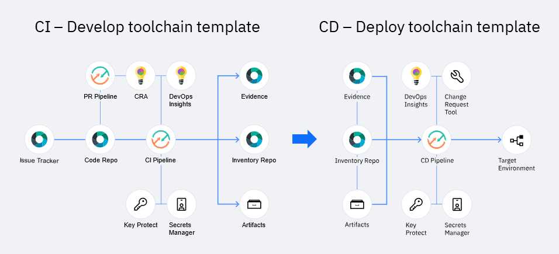{: caption="DevSecOps toolchain templates" caption-side="bottom"}

The solution provides a framework for custom user scripts to participate in a full compliant CI/CD orchestration of code and configuration changes, maintaining a [GitOps](https://www.ibm.com/garage/method/practices/run/gitops/){: external} release inventory, collecting evidences on the side to automate the generation of auditable change requests.

By default, the toolchain uses a sample Node.js "Hello World" app, but you can also bring your own app and link to it instead. This toolchain is configured with pipelines for Continuous Integration and Continuous Delivery with [Code Risk Analyzer (CRA)](/docs/ContinuousDelivery?topic=ContinuousDelivery-cd-configure-cra-repos), [{{site.data.keyword.secrets-manager_full}}](https://www.ibm.com/cloud/secrets-manager){: external} for centrally managing your secrets, detecting secrets that use [IBM Detect Secrets](https://github.com/IBM/detect-secrets){: external}, source control, issue tracking, and online editing.

### Understanding the pipelines
{: #devsecops-tutorial-overview-pipelines}

* **Pull Request (PR) Pipeline:** This pipeline is triggered when a merge or pull request is created in the Application Source Code Repository. Typically, this request is manually created by the application source code developer to merge changes from their development branch to the master branch or any other branch. The PR Pipeline runs the Unit Test and Static Scans on the Application Source Code.
* **Continuous Integration (CI) Pipeline:** This pipeline is triggered when a change is merged to the master branch of the Application Source Code repository. The CI Pipeline runs the Unit Test, Code Coverage, Static Scans, and Dynamic Scans on the Application Source Code, CIS check, and Bill Of Materials (BOM) check. The CI Pipeline also generates the binary build artifact and a signature and uploads them to the IBM Container Registry as configured in the toolchain. And the CI Pipeline generates the metadata of the build artifacts and stores it in the Inventory repository.
* **Promotion (CD) Pipeline:** Manually running the Promotion Pipeline creates a new Merge / Pull request to push the latest code changes from the source (master) branch to the target branch (prod or stage) of your inventory repository. Merging this MR/PR triggers the CD pipeline.
* **Continuous Deployment (CD) Pipeline:** The CD Pipeline is responsible for approval and deployment of the build artifacts to the deployment environment. The pipeline verifies the successful deployment of the application by running the health check. This pipeline must be manually triggered after you merge the Merge / Pull request created by the Promotion Pipeline. 

Let's now get started with the creation and exploration of the CI and CD templates in that sequence.

## Before you begin
{: #devsecops-tutorial-prereqs}

To set up the prerequisites for your toolchains, follow these steps:

1. Set up an [{{site.data.keyword.cloud_notm}} account](https://{DomainName}/registration){: external}. Depending on your {{site.data.keyword.cloud_notm}} account type, access to certain resources might be limited. Depending on your account plan limits, certain capabilities that are required by some DevSecOps toolchains might not be available. For more information, see [Setting up your {{site.data.keyword.cloud_notm}} account](/docs/account?topic=account-account-getting-started) and [Upgrading your account](/docs/account?topic=account-upgrading-account).
1. Store all of the secrets in a secrets management vault and manage them centrally from a single location. [Managing {{site.data.keyword.cloud_notm}} secrets](/docs/secrets-manager?topic=secrets-manager-manage-secrets-ibm-cloud) can help you to choose from various secrets management and data protection offerings. If you don't already have an instance of the secrets management vault provider of your choice, create one.
1. Create a [Kubernetes cluster](/kubernetes/catalog/cluster/create){: external}. Be sure to select the **Free** pricing plan. The cluster might take some time to provision. As the cluster is created, it progresses through these stages: Deploying, Pending, and Ready. [Learn more.](/docs/containers?topic=containers-clusters).
1. Create an [{{site.data.keyword.registrylong}} namespace](https://cloud.ibm.com/registry/namespaces){: external}. {{site.data.keyword.registrylong_notm}} provides a multi-tenant private image registry that you can use to store and share your container images with users in your {{site.data.keyword.cloud_notm}} account. Select the location for your namespace, and click **Create**. [Learn more.](/docs/Registry?topic=Registry-getting-started)
1. **Optional.** Create an [image signing key](/docs/devsecops?topic=devsecops-devsecops-image-signing) with the proper encoding to sign your application docker images.
1. **Optional.** Create an [{{site.data.keyword.cloud_notm}} API key](https://cloud.ibm.com/iam/apikeys){: external}. Save the API key value by either copying, downloading it or adding it to your vault. Alternatively, you can create the API key during the template guided setup process.
1. **Optional.** Validate that the [recommended IAM permissions](/docs/devsecops?topic=devsecops-cd-devsecops-iam-permissions) are assigned to corresponding integrations.
1. **Optional.** [Install the {{site.data.keyword.cloud_notm}} CLI](/docs/cli?topic=cloud-cli-getting-started).
1. **Optional.** Create an [{{site.data.keyword.cos_full_notm}} instance and bucket](/docs/devsecops?topic=devsecops-cd-devsecops-cos-config). [Learn more.](/docs/cloud-object-storage?topic=cloud-object-storage-about-cloud-object-storage)

If you want to automatically set up the DevSecOps infrastructure for your toolchains by using an [{{site.data.keyword.bplong}} workspace](/docs/schematics?topic=schematics-about-schematics) and a Terraform-based quick start template, skip the previous steps and go to [Set up your DevSecOps infrastructure and CI toolchain for deploying a secure app](/docs/apps?topic=apps-tutorial-apps-devsecops). After the prerequisites and CI toolchain are successfully configured, proceed to the [Continuous Delivery (CD) toolchain introduction](#devsecops-cd-toolchain-intro).
{: tip}

## Continuous Integration (CI) toolchain introduction
{: #devsecops-ci-toolchain-intro}

The toolchain enables Continuous Delivery with source control, delivery pipelines for pull requests, and Continuous Integration. The delivery pipeline performs static code scans on source repositories, runs unit tests, builds docker image, scans application docker image for vulnerabilities, and applies a signature to the built image.

The toolchain collects pipeline run data at every stage as evidence for auditing purposes and offers an option to store it in the immutable form in IBM Cloud Object Storage. It enables the development team to record every successful application build as artifacts stored in the inventory repository.

The DevOps Insights integration in the toolchain enables analysis of historical build data, evidences, trends, and detection anomalies.

### Continuously deliver a secure container app to a Kubernetes Cluster
{: #devsecops-ci-toolchain-deliver}

The target cluster is configured during toolchain setup (by using an {{site.data.keyword.cloud_notm}} API key and cluster name). You can later change these settings by altering the Delivery Pipeline configuration. Any code merged to the target Git repository branch is automatically built, validated, and deployed into the Kubernetes cluster.

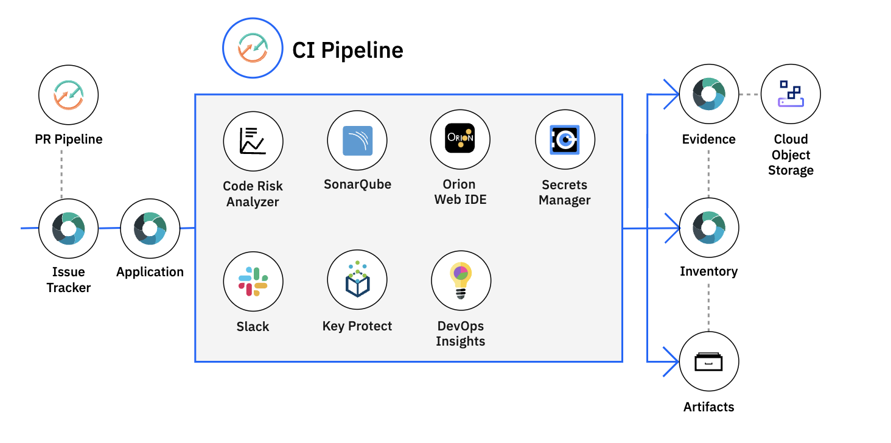{: caption="DevSecOps Continuous Integration toolchain" caption-side="bottom"}

The CI toolchain implements the following best practices:

* Runs a static code scanner on the application repositories to detect secrets in the application source code and vulnerable packages that are used as application dependencies
* Builds a container image on every Git commit, setting a tag based on build number, timestamp, and commit ID for traceability
* Test the Dockerfile before you create the image
* Use a private image registry to store the built image, automatically configure access permissions for target cluster deployment by using API tokens that can be revoked
* Scan the container image for security vulnerabilities
* Add a Docker signature upon successful completion
* Insert the built image tag into the deployment manifest automatically
* Use an explicit namespace in cluster to insulate each deployment (and make it easy to clear, by "kubectl delete namespace")

## Guided setup overview for the CI toolchain
{: #devsecops-ci-toolchain-guided-setup}

Any of the methods in this tutorial takes you to the guided setup experience. You are guided through the toolchain setup process in a logical order, and you are presented with the recommended configuration options that are needed to create your toolchain.

A progress indicator shows the steps to complete the configuration. You can use the progress indicator to navigate to a previous step with a mouse click. The configuration options for the current step are displayed in the main area of the page.

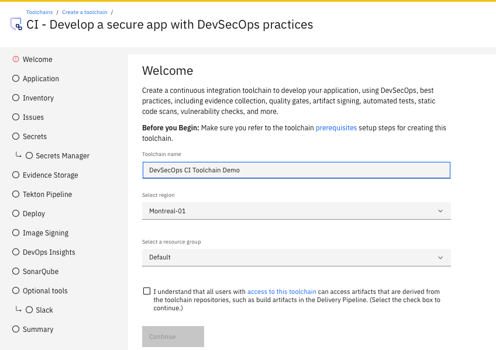{: caption="DevSecOps Continuous Integration toolchain welcome page" caption-side="bottom"}

To advance to the next step, click **Continue**. You can advance to the next step only when the configuration for the current step is complete and valid. You can navigate to the previous step by clicking **Back**.

Some steps include an **Advanced Options** toggle. These steps by default present you with the minimum recommended configuration needed. However, advanced users that need finer grained control can click the **Advanced Options** toggle to reveal all options for the underlying integration.

{: caption="DevSecOps Advanced options toggle" caption-side="bottom"}

After all the steps are successfully completed, you create the toolchain by clicking **Create** on the Summary step.

You can always go back to previous steps in the guided installer. The toolchain installer retains all the configuration settings from the successive steps.
{: tip}

## Start the CI toolchain setup
{: #devsecops-ci-toolchain-create-options}
{: step}

Start the CI toolchain configuration by using one of the following options:

* Click the following **Create toolchain** button.

   {: external}

* From the {{site.data.keyword.cloud_notm}} console, click the **Menu** icon  and select **DevOps**. On the Toolchains page, click **Create toolchain**. On the Create a Toolchain page, click **CI-Develop with DevSecOps practices**.

## Set up the CI toolchain name and region
{: #devsecops-ci-toolchain-name-region}
{: step}

Review the default information for the toolchain settings. The toolchain's name identifies it in {{site.data.keyword.cloud_notm}}. Make sure that the toolchain's name is unique within your toolchains for the same region and resource group in {{site.data.keyword.cloud_notm}}.

The toolchain region can differ from cluster and registry region.
{: note}

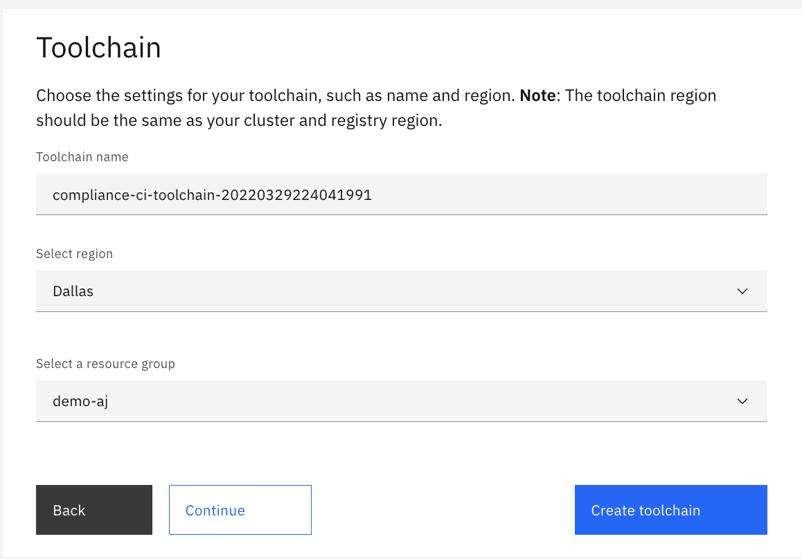{: caption="DevSecOps CI toolchain name and region" caption-side="bottom"}

## Set up CI tool integrations
{: #devsecops-ci-tool-integrations}
{: step}

Multiple repositories must be configured during the guided setup, as described in the next sections.

For each repository, you can either clone the repository that's provided as a sample, or you can provide a URL to an existing IBM-hosted Git Repos and Issue Tracking (GRIT) repository that you own. The toolchain supports linking only to existing GRIT repositories.
{: note}

### Application
{: #devsecops-ci-tool-integration-application}

The Application step that refers to the application source code repository is shown in the following image.

For the application source code repository, you can choose either GitHub or the IBM-hosted Git Repos and Issue Tracking (GRIT) repository from the list of source providers. For consistency, this tutorial refers to Git Repos and Issue Tracking (GRIT).
{: note}

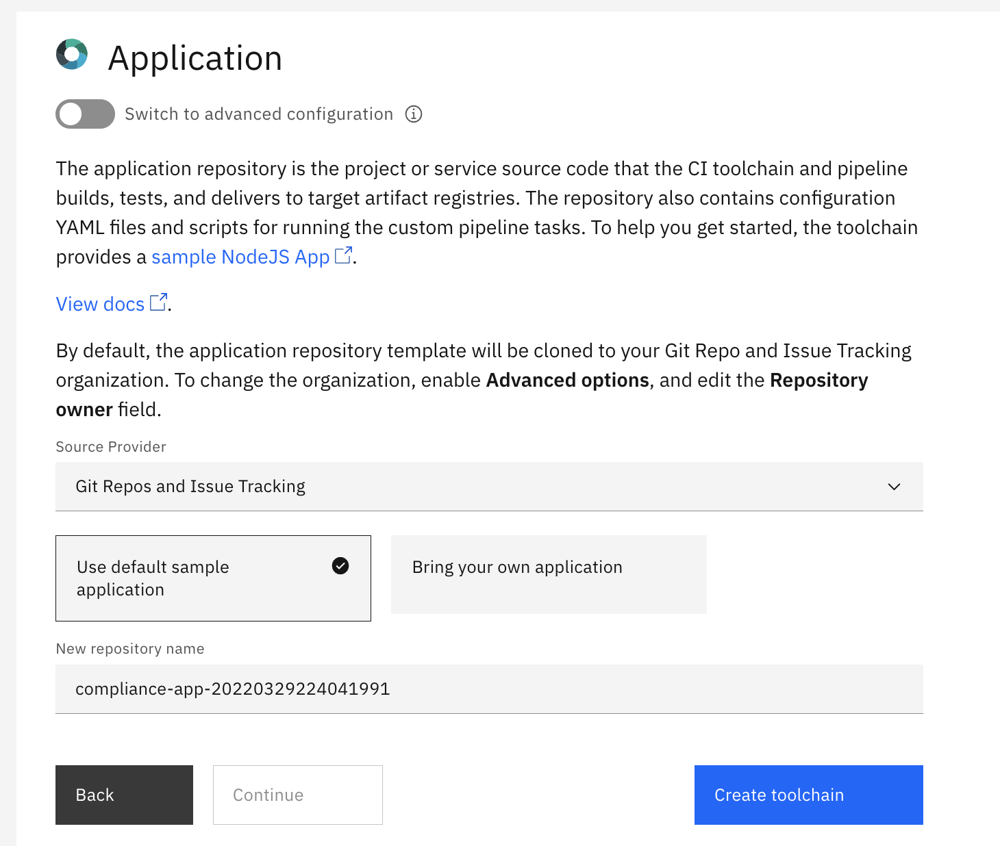{: caption="DevSecOps application repository" caption-side="bottom"}

The recommended options are displayed by default, but you can click the **Advanced Options** toggle to see all of the configuration options available for the underlying Git integration. The default behavior of the toolchain is `Use default sample` that clones the sample application as IBM-hosted GRIT Repository.

Enter the name of the IBM-hosted GRIT repository that was created by the toolchain as your application repository.

The region of the repository remains the same as the region of the toolchain.

If you want to link an existing Application Repository for the toolchain, select the `Bring your own app` option, and provide it as input to `Repository URL` field. As noted earlier, the toolchain currently supports linking only to existing GRIT repositories. If you want to know more about `Bring your own app`, see [Bringing your own app to DevSecOps](/docs/devsecops?topic=devsecops-cd-devsecops-apps-byoa).

### Inventory
{: #devsecops-ci-tool-integration-inventory}

The inventory repository records details of artifacts that are built by the CI toolchains.

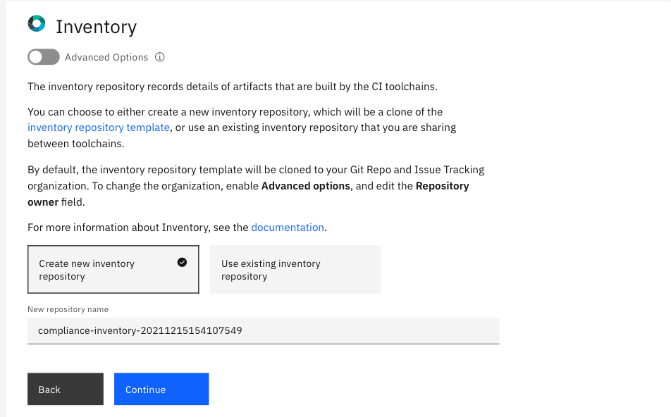{: caption="DevSecOps inventory repository" caption-side="bottom"}

### Issues
{: #devsecops-ci-tool-integration-issues}

The Git Repos and Issue Tracking repository records issues that are found while the CI pipeline is running.

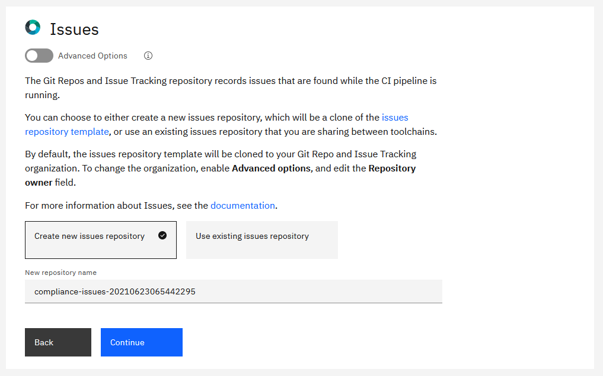{: caption="DevSecOps issues repository" caption-side="bottom"}

### Secrets
{: #devsecops-ci-tool-integration-secrets}

Several tools in this toolchain require secrets to access privileged resources. An {{site.data.keyword.cloud_notm}} API key is an example of such a secret. All secrets should be stored securely in a secrets vault and then referenced as required by the toolchain.

With {{site.data.keyword.cloud_notm}}, you can choose from various secrets management and data protection offerings that help you to protect your sensitive data and centralize your secret. The Secrets step allows you to specify which secret vault integrations are added to your toolchain. Use the provided toggles to add or remove the vault integrations that you require as explained in [Managing {{site.data.keyword.cloud_notm}} secrets](/docs/secrets-manager?topic=secrets-manager-manage-secrets-ibm-cloud). This documentation gives you information on prerequisites and how to use a list of prescribed secret names that are otherwise known as hints. By using hints in a template, a toolchain can be automatically populated with preconfigured secrets without any need to manually select them from various vault integrations that are attached to the toolchain.

This tutorial uses IBM Secrets Manager as the vault for secrets.

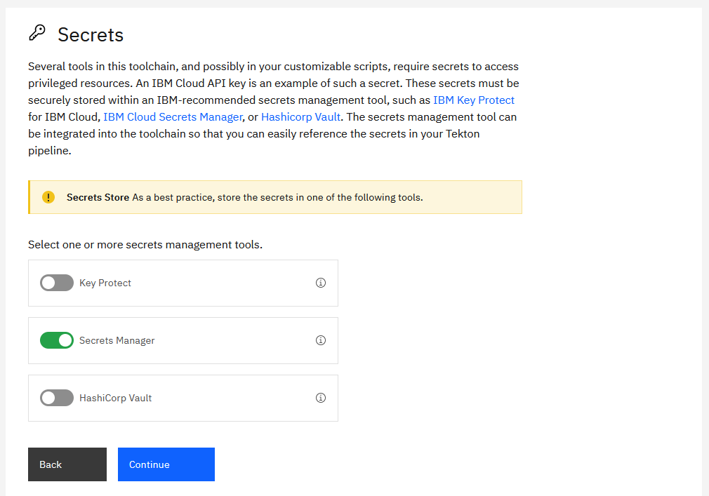{: caption="DevSecOps secrets options" caption-side="bottom"}

Use [IBM Secrets Manager](/docs/secrets-manager?topic=secrets-manager-getting-started) to securely store and apply secrets like API keys, Image Signature, or HashiCorp credentials that are part of your toolchain.

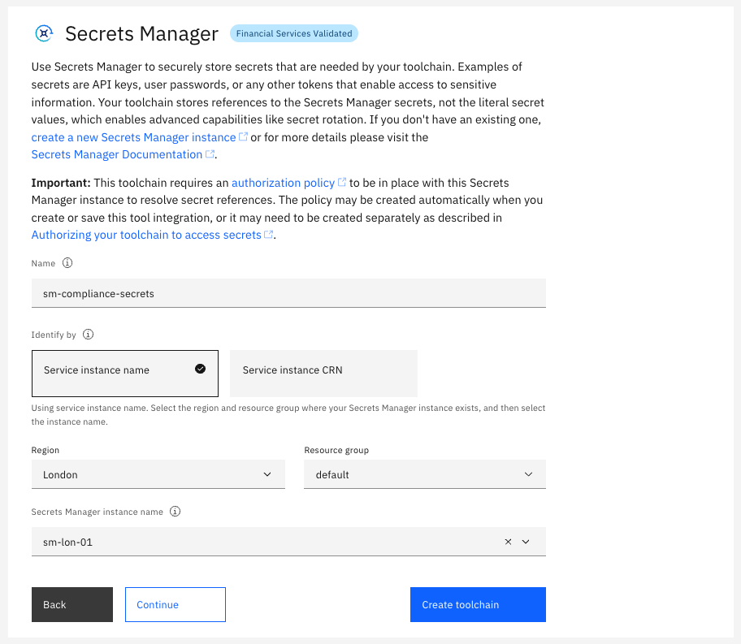{: caption="DevSecOps IBM Secrets Manager" caption-side="bottom"}

If you plan to use IBM Key Protect or HashiCorp vault for managing your secrets, see the [IBM Key Protect section of the CI setup guide](/docs/devsecops?topic=devsecops-cd-devsecops-tekton-ci-compliance#cd-devsecops-key-protect-ci).

### Evidence Storage
{: #devsecops-ci-tool-integration-evidence-storage}

All raw compliance evidence that belongs to the application is collected in this repository. This repository option should be used only for evaluation purposes. However, it is recommended to collect and store all the evidences in a Cloud Object Storage bucket that can be configured as described in the following image.

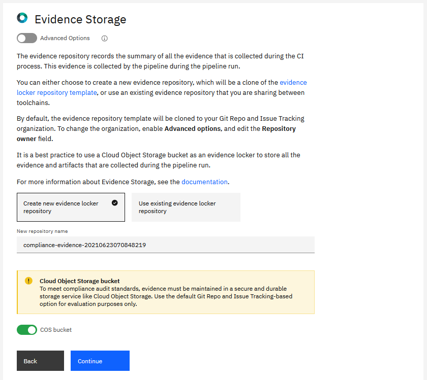{: caption="DevSecOps Evidence Storage" caption-side="bottom"}

### Cloud Object Storage Bucket
{: #devsecops-ci-tool-integration-cos-bucket}

[Cloud Object Storage](/docs/cloud-object-storage?topic=cloud-object-storage-about-cloud-object-storage) is used to store the evidence and artifacts that are generated by the DevSecOps Pipelines. If you want to use this feature, you must have a Cloud Object Storage instance and a Bucket. Read the recommendation for configuring a Bucket that can act as a Compliance Evidence Locker.

You can optionally set any kind of Cloud Object Storage bucket as a locker, even without a retention policy. The pipeline doesn't check or enforce settings at the moment. For help, see the [Cloud Object Storage documentation](/docs/cloud-object-storage?topic=cloud-object-storage-getting-started-cloud-object-storage).
{: note}

You need to select the following information for the Pipelines to reach the bucket:

* Cloud Object Storage Instance 
* Bucket name
* Cloud Object Storage endpoint
* Service API key

You can set up the Cloud Object Storage locker later, by providing the necessary cos-bucket-name and cos-endpoint. To remove the Cloud Object Storage bucket, use the Cloud Object Storage bucket toggle in the previous step.

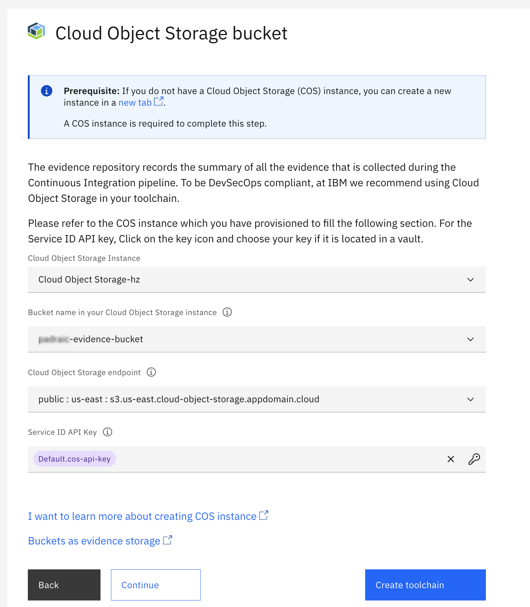{: caption="DevSecOps Cloud Object Storage menu" caption-side="bottom"}

If you decide not to use Cloud Object Storage as an evidence locker, you can also set the required values after the creation of the toolchain by setting the cos-bucket-name, cos-endpoint environment variables in the CI Pipeline.

### Tekton Pipeline
{: #devsecops-ci-tool-integration-tekton-pipeline}

The toolchain comes with an integrated Tekton pipeline to automate continuous build, test, and deploy of the application to development cluster. This repository contains Tekton resources that are defined in YAML files that carry out the pipeline tasks. These repositories can be contributed to or can be forked although it is highly recommended to use the default repository provided by this step.

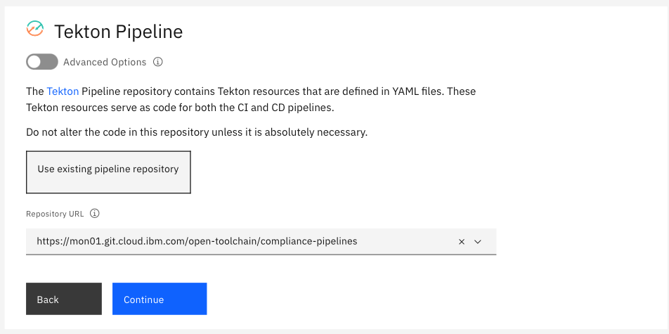{: caption="DevSecOps Tekton Pipeline" caption-side="bottom"}

### Deploy
{: #devsecops-ci-tool-integration-deploy}

Configure the target Kubernetes cluster where the application will be deployed. Once the application passes the build, test and scan phase the pipeline deploys the built application image to target Kubernetes cluster. This deployment is then ready for acceptance test or integration test.

* **App name:**
   The name of the application.
   * Default: hello-compliance-app

* **{{site.data.keyword.cloud_notm}} API Key:**
   The API key is used to interact with the ibmcloud CLI tool in several tasks.
   * Preferred: An existing key can be imported from an existing Key Protect Instance by clicking the key icon.
   * An existing key can be copy and pasted.
   * A new key can be created from here by clicking the **New +**.
   * Generate a new api-key if you don’t have one or copy an existing key to the field.

The newly generated API key can be immediately saved to an existing Key Protect instance.
{: tip}

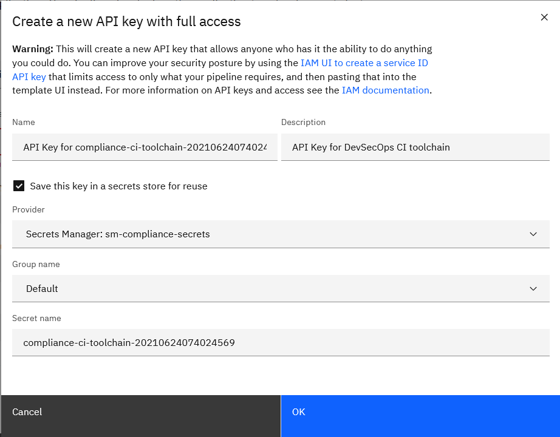{: caption="DevSecOps API key" caption-side="bottom"}

Using the API key that is either created, retrieved from a vault, or manually entered the following fields load automatically if the API key has sufficient access. If the API key is valid, the Container registry region and namespace Cluster region, name, namespace and Resource group will be automatically populated. You may change any of these fields to match your configuration if needed.

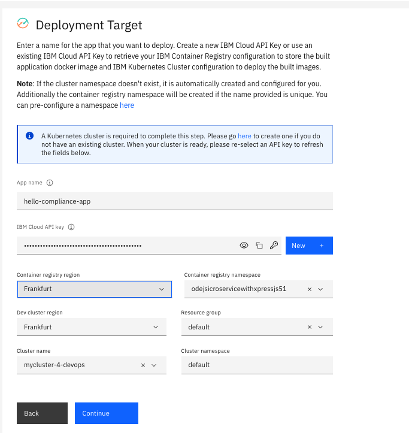{: caption="DevSecOps deployment target" caption-side="bottom"}

### Image Signing
{: #devsecops-ci-tool-integration-image-signing}

Any images built by this toolchain and recorded in the inventory must be signed before they can be deployed to production. The pipeline uses [Skopeo](https://github.com/containers/skopeo) as default tool to provide Image signing capability. You can use an existing GPG Key or create a new [GPG Key Pair](/docs/devsecops?topic=devsecops-devsecops-image-signing).

Ensure that the key follows the appropriate encoding as required by the chosen tool to store secrets.
{: note}

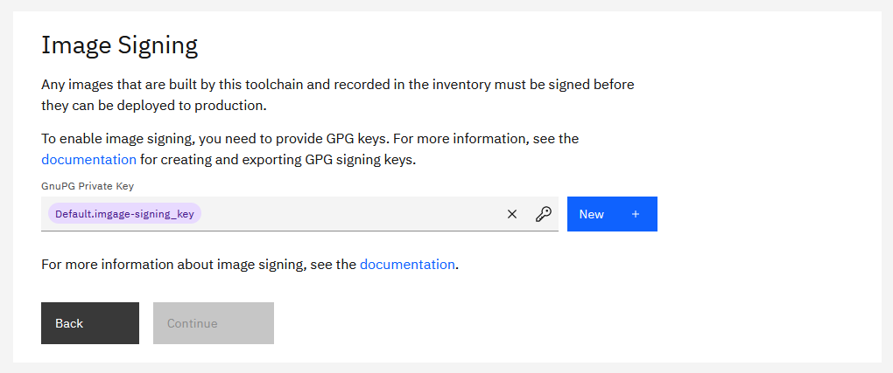{: caption="DevSecOps Image Signing" caption-side="bottom"}

### DevOps Insights
{: #devsecops-ci-tool-integration-insights}

[IBM Cloud DevOps Insights](/docs/ContinuousDelivery?topic=ContinuousDelivery-di_working) is included in the created toolchain and after each compliance check evidence is published into it. You do not need to provide any configuration steps for DevOps Insights, the CI pipeline will automatically use the insights instance included in the toolchain.  DevOps Insights aggregates code, test, build, and deployment data to provide visibility into the velocity and quality of all your teams and releases.

### SonarQube
{: #devsecops-ci-tool-integration-sonarqube}

Configure SonarQube as the static code analysis tool for the toolchain. SonarQube provides an overview of the overall health and quality of your source code and highlights issues that are found in new code. The static code analyzers detect tricky bugs, such as null-pointer dereferences, logic errors, and resource leaks for multiple programming languages.

With **Default Configuration**, the pipeline provisions a new SonarQube instance in the Kubernetes cluster that is configured in the **Deploy** step. This instance is provisioned during the first pipeline run and remains available to all the subsequent pipeline runs.

If you want the toolchain to use an existing SonarQube Instance that you have provisioned on another host, use the **Custom Configuration** option.

### Optional tools
{: #devsecops-ci-tool-integration-optional-tools}

#### Slack
{: #devsecops-ci-tool-integration-optional-slack}

If you want to receive notifications about your PR/CI Pipeline events, you can configure the [Slack Tool](/docs/ContinuousDelivery?topic=ContinuousDelivery-slack) during the setup from the toolchain template, or you can add the Slack Tool later.

In order for a Slack channel to receive notifications from your tools, you need a Slack webhook URL. To get a webhook URL, see the Incoming Webhooks section of the [Slack API website](https://api.slack.com/messaging/webhooks){: external}.

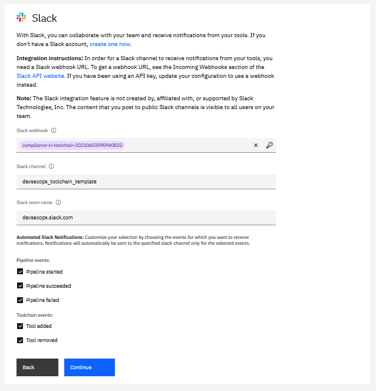{: caption="DevSecOps Slack" caption-side="bottom"}

#### Orion WebIDE
{: #devsecops-ci-tool-integration-optional-webide}

The Eclipse [Orion Web IDE](/docs/ContinuousDelivery?topic=ContinuousDelivery-web_ide) is a browser-based development environment where you can develop for the web in JavaScript, HTML, and CSS with the help of content assist, code completion, and error checking. 

#### Delivery Pipeline Private Worker
{: #devsecops-ci-tool-integration-optional-private-worker}

The [Delivery Pipeline Private Worker](/docs/ContinuousDelivery?topic=ContinuousDelivery-private-workers) tool integration connects with one or more private workers that can run Delivery Pipeline workloads in isolation.

## Create the CI toolchain
{: #devsecops-ci-toolchain-summary}
{: step}

On the Summary page, click **Create**, and wait for the toolchain to be created.

The individual toolchain integrations can be configured also after the pipeline is created.
{: tip}

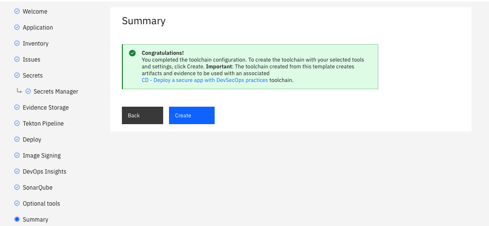{: caption="DevSecOps Summary" caption-side="bottom"}

## Explore the CI toolchain
{: #devsecops-ci-toolchain-explore}
{: step}

The created CI toolchain will look like this:

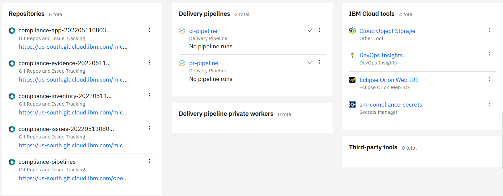{: caption="DevSecOps Continuous Integration Toolchain" caption-side="bottom"}

It contains two pipelines:
* **PR**: triggers when a new PR is submitted in the app repository
* **CI**: manually run or triggers when a PR is merged to master in the app repository

### Run the ci-pr Pipeline
{: #devsecops-ci-toolchain-pr-pipeline-run}

To start the PR pipeline, you should create a merge request in your application repository. To achieve this, do the following:
1. On the CI toolchain page, click the application repository tile. By default it gets created with a name `compliance-app-<timestamp>`.
1. Create a branch from master.
1. Update some code like in app or readme file and save changes.
1. Submit merge request.
1. Back on the CI toolchain page, click the `pr-pipeline` tile. Observe: the PR pipeline has been initiated.

The corresponding Merge Request in your application repository will be in "Pending" state until all the stages of PR Pipeline finish successfully.

After the PR Pipeline run is successful, you can click it to explore numerous steps completed.

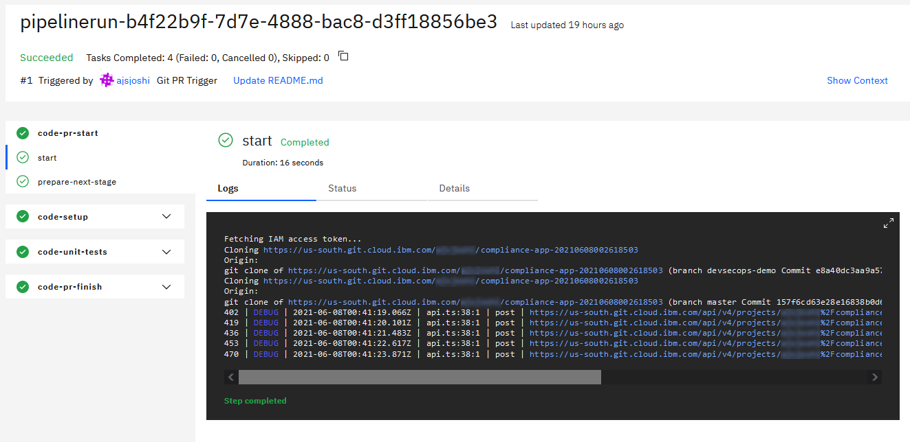{: caption="DevSecOps PR Pipeline Successful" caption-side="bottom"}

1. Navigate back to the merge request.
1. Merge the request so that your changes are copied to the master branch of your application repository: the CI pipeline is automatically triggered.

Simplified flow of tasks in the pipeline: (Utility tasks have been omitted. For example, status-check update on GitHub, credential fetching).

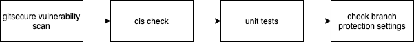{: caption="DevSecOps PR Tasks" caption-side="bottom"}

In the DevSecOps world, shift left is a practice referred to preventing and finding issues like defects, security vulnerabilities and performing compliance checks early in the software delivery process.

* Checks that can be run on the code/repository itself and do not need the built image, should be run as early as possible to prevent non-compliant code from being merged to master branch of repository. Evidence is not collected from the PR pipeline, its goal is to shift compliance checks, as far left as possible.
* All checks are done every pipeline run, even if a previous check fails, the pipeline progresses to the next one. To evaluate if you have any failures in your run, you need to check the final step of your pipeline, which has a pipeline evaluator.
* If you are trying to merge an emergency fix, and want to bypass compliance checks, add a label to your merge request to indicate this. The same label must be provided when running the CD pipeline.

### Run the CI pipeline
{: #devsecops-ci-toolchain-ci-pipeline-run}

There are two ways to start a CI pipeline:
* Automatically: after a successful PR pipeline, by approving and merging the PR to the master branch.
* Manually: to trigger the CI pipeline manually, select the Delivery Pipeline card and click **Run Pipeline** and select `Manual Trigger`.

In this tutorial, the CI Pipeline was triggered after you merged your code changes to the master branch of your application repository.
1. On the CI toolchain page, click the `ci-pipeline` tile.
1. Observe: a pipeline-run is running. Wait for the pipeline-run to complete.

After the CI Pipeline run is successful, you can click it to explore the completed steps.

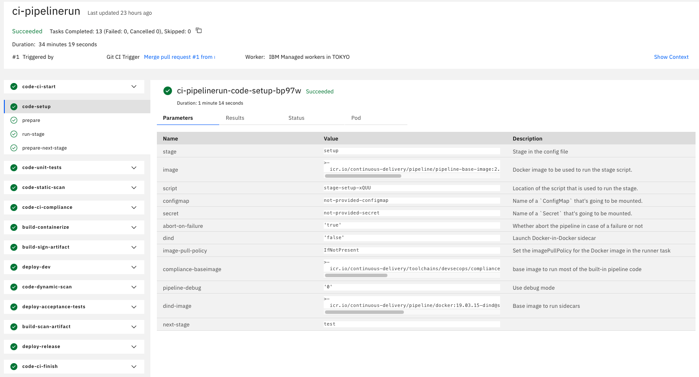{: caption="DevSecOps CI Pipeline Successful" caption-side="bottom"}

Simplified flow of tasks in the pipeline: (Again, utility tasks are omitted. For example, status-check update on GitHub, credential fetching, and so on) Green colored tasks are outputting evidence.

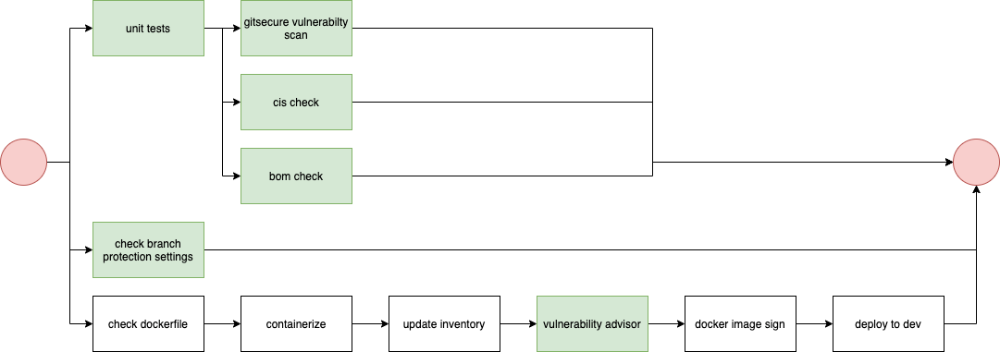{: caption="DevSecOps CI Tasks" caption-side="bottom"}

Evidence is collected from all compliance checks in the CI pipeline, to the evidence-locker repository, that was provided during toolchain setup. Evidence from CI is stored under `raw/ci/<pipeline-run-id>/*.json`.

Evidence is also published to the DevOps Insights instance inside the toolchain. You can navigate to it by clicking the DevOps Insights toolcard in the toolchain. You can review the collected evidence on the Quality Dashboard page.

{: caption="DevSecOps CI Evidence" caption-side="bottom"}

To evaluate if you have any failures in your pipeline run, you need to check the final step of your pipeline, which has a pipeline evaluator.
{: note}

### Viewing the running application
{: #devsecops-ci-toolchain-view-app}

After a successful CI pipeline run, the sample application is deployed on your Kubernetes cluster, and is running in the dev namespace.

The app url can be found at the end of the log of the `run stage` step of `deploy-dev` task of the CI Pipeline run. Use that url to verify that the app is running.

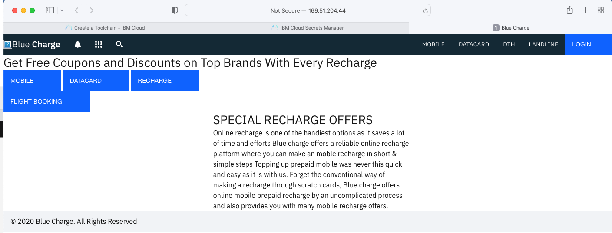{: caption="DevSecOps CI sample app" caption-side="bottom"}

### Pipeline configuration
{: #devsecops-ci-toolchain-pipeline-config}

The repository contains custom scripts to carry out pipeline tasks in the CI Pipelines (.pipeline-config.yaml). Refer to [hello-compliance-deployment](https://us-south.git.cloud.ibm.com/open-toolchain/hello-compliance-deployment) sample repository that contains some default configuration and scripts.

By default, the setup Clone deployment configuration from the sample repository. After the repository is cloned, you can customize configurations and scripts for pipeline runs.

More detailed information on customizing the CI pipelines can be found [here](/docs/devsecops?topic=devsecops-custom-scripts). 

### Wrapping up
{: #devsecops-ci-toolchain-done}

Congratulations!

By completing the CI part of this tutorial, you:
* created a DevSecOps CI toolchain
* modified some code in the application repository
* ran the ci-pr pipeline before merging your changes
* ran the ci-pipeline to build, test, and deploy your changes to your dev environment.

Let's proceed with Continuous Delivery (CD) now.

## Continuous Delivery (CD) toolchain introduction
{: #devsecops-cd-toolchain-intro}

### Tekton CD pipeline with compliance automation for Kubernetes
{: #devsecops-cd-toolchain-tekton-pipeline}

This is the toolchain template for continuous deployment with security and compliance-related best practices in DevSecOps. It is preconfigured for Continuous Delivery with inventory integration, change management with Git Repos and Issue Tracking, evidence collection, and deployment to the IBM Kubernetes Service.

The integrated repositories, target cluster, and other integrations are configured during the setup process.

The toolchain includes a Tekton delivery pipeline, which can be manually triggered to initiate a new deployment.

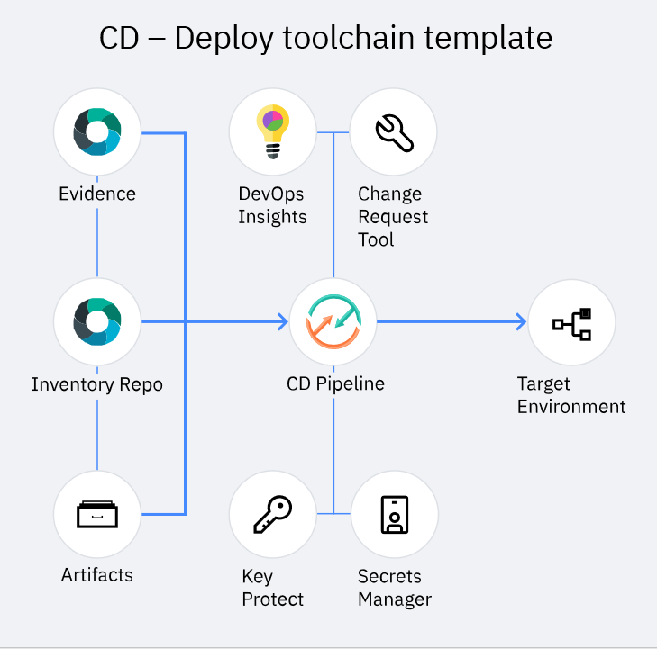{: caption="DevSecOps CD deployment" caption-side="bottom"}

The CD toolchain contains only one pipeline for Continuous Delivery. It implements the following best practices:
* change Management automation to help developers, approvers, and auditors track deployments from the lens of compliance.
* creates an evidence summary from the evidence collected in the CI pipeline
* creates a change request in Git Repos and Issue Tracking based change management repository and adds deployment evidence to it
* uses the inventory repository to promote built artifacts to deployment environments like staging and prod
* checks the CR and auto approves if all checks have passed
* if CR is approved, or emergency, deploys the image from the inventory to production

## Guided setup overview for the CD toolchain
{: #devsecops-cd-toolchain-guided-setup}

Any of the methods in this tutorial takes you to the guided setup experience. You are guided through the toolchain setup process in a logical order, and you are presented with the recommended configuration options that are needed to create your toolchain.

A progress indicator shows the steps to complete the configuration. You can use the progress indicator to navigate to a previous step with a mouse click. The configuration options for the current step are displayed in the main area of the page.

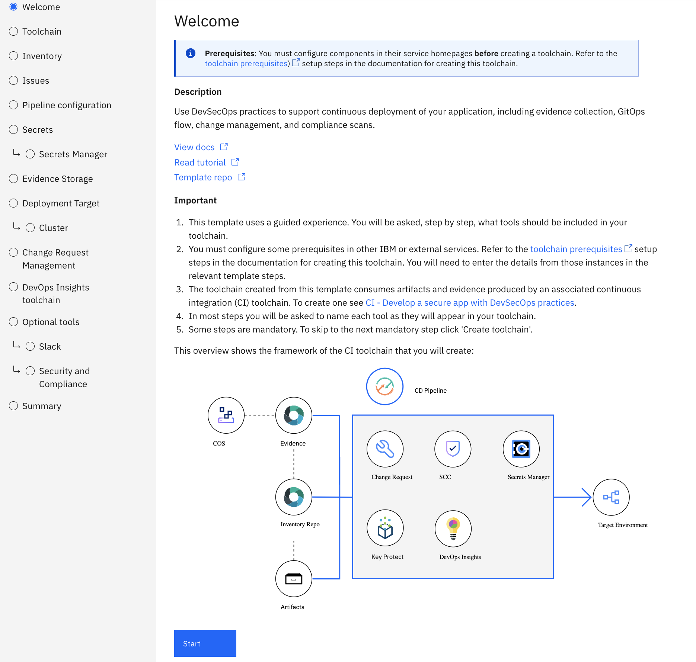{: caption="DevSecOps Continuous Delivery toolchain welcome page" caption-side="bottom"}

To advance to the next step, click **Continue**. You can advance to the next step only when the configuration for the current step is complete and valid. You can navigate to the previous step by clicking **Back**.

Some steps include an **Advanced Options** toggle. These steps by default present you with the minimum recommended configuration needed. However, advanced users that need finer grained control can click the **Advanced Options** toggle to reveal all options for the underlying integration.

{: caption="DevSecOps Advanced options toggle" caption-side="bottom"}

After all the steps are successfully completed, you create the toolchain by clicking **Create** on the Summary step.

You can always go back to previous steps in the guided installer. The toolchain installer retains all the configuration settings from the successive steps.
{: tip}

## Start the CD toolchain setup
{: #devsecops-cd-toolchain-create-options}
{: step}

Start the CD toolchain configuration by using one of the following options:

* Click the following **Create toolchain** button.

   {: external}

* From the {{site.data.keyword.cloud_notm}} console, click the **Menu** icon  and select **DevOps**. On the Toolchains page, click **Create toolchain**. On the Create a Toolchain page, click **CD-Develop with DevSecOps practices**.

## Set up the CD toolchain name and region
{: #devsecops-cd-toolchain-name-region}
{: step}

Review the default information for the toolchain settings. The toolchain's name identifies it in {{site.data.keyword.cloud_notm}}. Make sure that the toolchain's name is unique within your toolchains for the same region and resource group in {{site.data.keyword.cloud_notm}}.

The toolchain region can differ from cluster and registry region.
{: note}

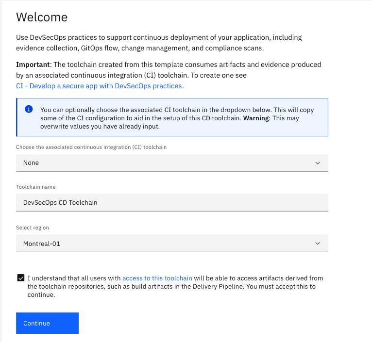{: caption="DevSecOps CD toolchain name and region" caption-side="bottom"}

## Set up CD tool integrations
{: #devsecops-cd-tool-integrations}
{: step}

This section covers the setup of the various tool and service integrations that the CD toolchain uses.

If you used CI toolchain template to set up your CI process, refer to your CI toolchain, and copy the names of the application-related repositories that are used in that toolchain.
{: tip}

If you want to set up your CI toolchain from scratch, configure these repositories during CI toolchain creation, and then use them here.

### Application-related repositories
{: #devsecops-cd-tool-integration-application}

**Inventory**: Change management is tracked in this repository. After each successful CI Pipeline run, CD pipeline creates a new branch that is named as the created CR number, and merges it to master after deployment is concluded. To fetch the respective URL, go to the CI Pipeline, select the respective tool card. Click the tool card menu, select "Configure" and copy the url under `Repository URL`

Example: `https://<region>.git.cloud.ibm.com/myorg/my-compliance-ci-inventory`
* **Issues**: Issues about incidents that happen during the build and deployment process are stored here. For example: `https://<region>.git.cloud.ibm.com/myorg/my-compliance-ci-issues`.
* **Evidence**: All raw compliance evidence that belongs to the application is collected here. For example: `https://<region>.git.cloud.ibm.com/myorg/my-compliance-ci-evidence`.
* **Toolchain**: The tekton pipeline definitions (pipelines), triggers, listeners, and so on, are stored in this repository. For example: `https://<region>.git.cloud.ibm.com/myorg/my-compliance-ci-toolchain`.

After you capture the names of repositories from CI Toolchain, proceed with the Guided Setup to begin CD Toolchain creation. During the setup process, for each repository you may either provide url to an existing IBM hosted Git Repos and Issue Tracking (GRIT) repository that is created for your CI Toolchain or choose to create a new repository. Currently, the toolchain supports creating only GRIT repositories.

### Inventory
{: #devsecops-cd-tool-integration-inventory}

The default behavior of the toolchain is to use existing inventory to link an existing Inventory Repository for the toolchain. As noted earlier, the toolchain currently supports linking only to existing GRIT repositories.

**Repository URL**: URL of the Inventory Repository configured in your CI Toolchain as captured in the previous step.

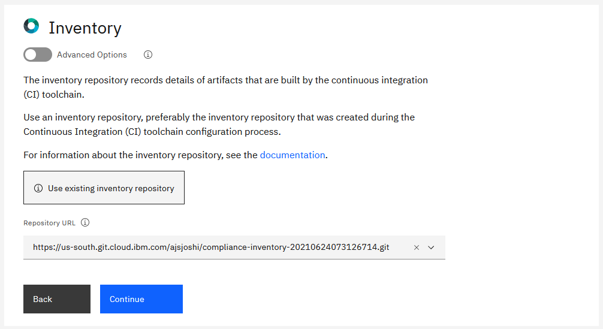{: caption="DevSecOps inventory repository" caption-side="bottom"}

### Issues
{: #devsecops-cd-tool-integration-issues}

The default behavior of the toolchain is to Use existing issues repository to link an existing Issues Repository for the toolchain. As noted earlier, the toolchain currently supports linking only to existing GRIT repositories.

**Repository URL**: URL of the Issues Repository configured in your CI Toolchain as captured in the previous step.

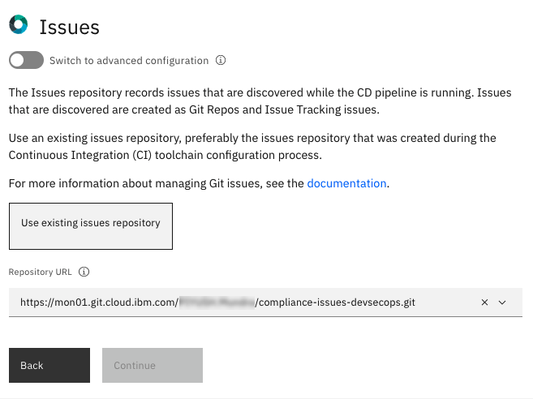{: caption DevSecOps issues repository" caption-side="bottom"}

### Pipeline Configuration
{: #devsecops-cd-tool-integration-pipeline-config}

The repository contains custom scripts to carry out pipeline tasks in the CD Pipeline (.pipeline-config.yaml). For more information, see the [hello-compliance-deployment](https://us-south.git.cloud.ibm.com/open-toolchain/hello-compliance-deployment) sample repository that contains some default configuration and scripts.

For the repository, you can choose either GitHub or the IBM-hosted Git Repos and Issue Tracking (GRIT) repository from the list of source providers. For consistency, this tutorial refers to Git Repos and Issue Tracking (GRIT).
{: note}

By default, the setup Clone deployment configuration from the sample repository. After the repository is cloned, you can customize configurations and scripts for pipeline runs.

More detailed information on customizing the CD pipeline can be found [here](/docs/devsecops?topic=devsecops-custom-scripts). 

**New repository name**: Name of the IBM hosted GRIT Repository created by the toolchain as your deployment configuration repository. The region of the repository remains the same as that of the toolchain. Choose a unique name for the new repository.

In case you have deployment configuration repository from an existing CD Toolchain, use the **Advanced Options** toggle to configure the same for this pipeline.

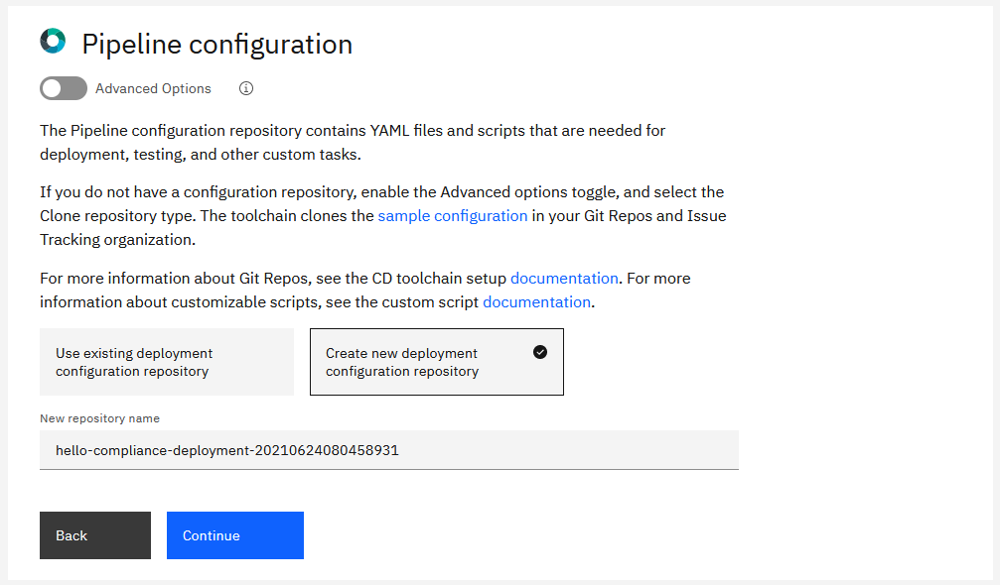{: caption="DevSecOps pipeline configuration" caption-side="bottom"}

### Secrets
{: #devsecops-cd-tool-integration-secrets}

Several tools in this toolchain require secrets to access privileged resources. An {{site.data.keyword.cloud_notm}} API key is an example of such a secret. All secrets should be stored securely in a secrets vault and then referenced as required by the toolchain.

With {{site.data.keyword.cloud_notm}}, you can choose from various secrets management and data protection offerings that help you to protect your sensitive data and centralize your secret. The Secrets step allows you to specify which secret vault integrations will be added to your toolchain. Use the provided toggles to add or remove the vault integrations that you require as explained in [Managing {{site.data.keyword.cloud_notm}} secrets](/docs/secrets-manager?topic=secrets-manager-manage-secrets-ibm-cloud). This documentation gives you information on prerequisites and how to leverage a list of prescribed secret names otherwise known as hints.  By using hints in a template, a toolchain can be automatically populated with preconfigured secrets without any need to manually select these from various vault integrations that are attached to the toolchain.

This tutorial uses IBM Secrets Manager as the vault for secrets.

{: caption="DevSecOps secrets options" caption-side="bottom"}

Use [IBM Secrets Manager](/docs/secrets-manager?topic=secrets-manager-getting-started) to securely store and apply secrets like API keys, Image Signature or HashiCorp credentials that are part of your toolchain.

{: caption="DevSecOps IBM Secrets Manager" caption-side="bottom"}

In case you plan to use IBM Key Protect or HashiCorp vault for managing your secrets, refer to details in the [CD Toolchain Setup Guide](/docs/devsecops?topic=devsecops-cd-devsecops-tekton-cd-compliance#ibm-key-protect)

### Evidence Storage
{: #devsecops-cd-tool-integration-evidence-storage}

All raw compliance evidence that belongs to the application is collected in this repository. This repository option should only be used for evaluation purposes.

The default behavior of the toolchain is to `Use existing evidence locker`. The `Repository URL` field can be set to the Evidence Repository URL that was created/used for CI Toolchain. In case you with to create new Evidence Locker for the toolchain, you can choose Create new evidence locker repository that creates a new repository as IBM hosted GRIT Repository.

However, it is recommended to collect and store all the evidences in a Cloud Object Storage bucket that can be configured as described in the following image.

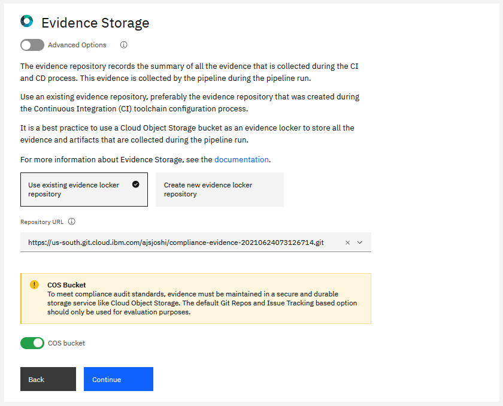{: caption="DevSecOps Evidence Storage" caption-side="bottom"}

### Evidence
{: #devsecops-cd-tool-integration-evidence}

**Repository URL**: URL of the Evidence Locker Repository configured in your CI Toolchain as captured in the previous step.

### Cloud Object Storage Bucket
{: #devsecops-cd-tool-integration-cos-bucket}

To remove the Cloud Object Storage Bucket, use the Cloud Object Storage Bucket toggle in the step.

Cloud Object Storage is used to store the evidences and artifacts that are generated by the Compliance Pipelines. If you want to use this feature, you must have a Cloud Object Storage instance and a Bucket. Read the recommendation for configuring a Bucket that can act as a Compliance Evidence Locker.

You can optionally set any kind of Cloud Object Storage bucket as a locker, even without a retention policy. The pipeline won't check or enforce settings at the moment. For help, see the [Cloud Object Storage documentation](/docs/cloud-object-storage?topic=cloud-object-storage-getting-started-cloud-object-storage).
{: note}

You need to select the following information for the Pipelines to reach the bucket:

* Cloud Object Storage Instance 
* Bucket name
* Cloud Object Storage endpoint
* Service API key

{: caption="DevSecOps Cloud Object Storage menu" caption-side="bottom"}

If you decide not to use Cloud Object Storage as an evidence locker, you can also set the required values after the creation of the toolchain by setting the cos-bucket-name, cos-endpoint environment variables in the CI Pipeline.

### Tekton Pipeline
{: #devsecops-cd-tool-integration-tekton-pipeline}

The toolchain comes with an integrated Tekton pipeline to automate continuous build, test, and deploy of the application to staging or production clusters. This repository contains Tekton resources that are defined in YAML files that carry out the pipeline tasks. The default behavior of the toolchain is to use the existing compliance pipeline.

**Repository URL**: URL of the Tekton Pipeline Definition Repository configured in your CI Toolchain as captured in the previous step.

The Pipeline Repository contains configurations for both CI and CD Toolchains and hence can be kept common across the two toolchains. In case you want to use separate pipeline definitions for CD Toolchain Tekton definitions use the Advanced Options toggle button to clone the repository.

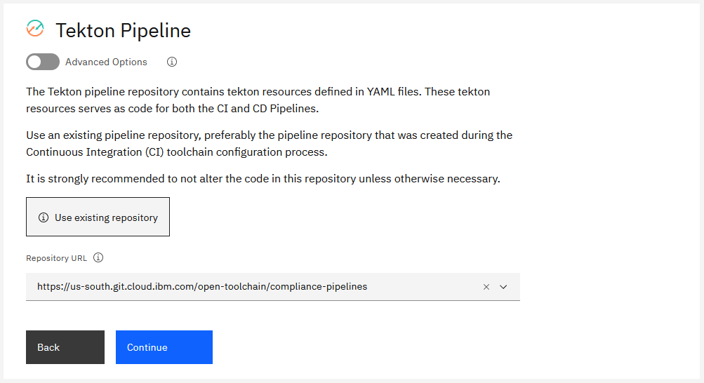{: caption="DevSecOps Tekton Pipeline" caption-side="bottom"}

### Deploy
{: #devsecops-cd-tool-integration-deploy}

Configure the target Kubernetes cluster where the application is deployed. Choose the target Kubernetes cluster that you intend to use as the production or stage environment. The toolchain deploys the build application image to the cluster and runs the acceptance-test and other compliance checks.

### IBM Cloud API Key
{: #devsecops-cd-tool-integration-api-key}

The API key is used to interact with the ibmcloud CLI tool in several tasks. If you already created a cluster, an API to access the cluster and stored the key in a secure vault (any of Key Protect, Secrets Manager, or HashiCorp Vault), as prerequisite you can use the same in this step.
* Option-1: An existing key can be imported from an existing Secret Provider instance that is created as prerequisites (Key Protect Instance, Secret Manager Instance or HashiCorp Vault) by clicking the key icon (Recommended)
* Option-2: An existing key can be copy and pasted (Not Recommended)
* Option-3: A new key can be created from here by clicking the New + button. Generate a new api-key if you don’t have one or copy an existing key to the field. The newly generated API key can be immediately saved to an existing Key Protect instance.

Click the Key Icon to use an existing key from your Secret Provider.
* **Provider**: The Secret Provider that stores your API Key to access the cluster, as linked to your toolchain earlier. It can be a Key Protect Instance, Secret Manager Instance, or Hashicorp Vault Instance.
* **Resource Group**: Resource Group that the Secrets Manager Provider belongs.
* **Secret name**: Name/Alias of the secret, such as the API Key.

Once the API Key field is filled, the registry and cluster-related fields are filled automatically.

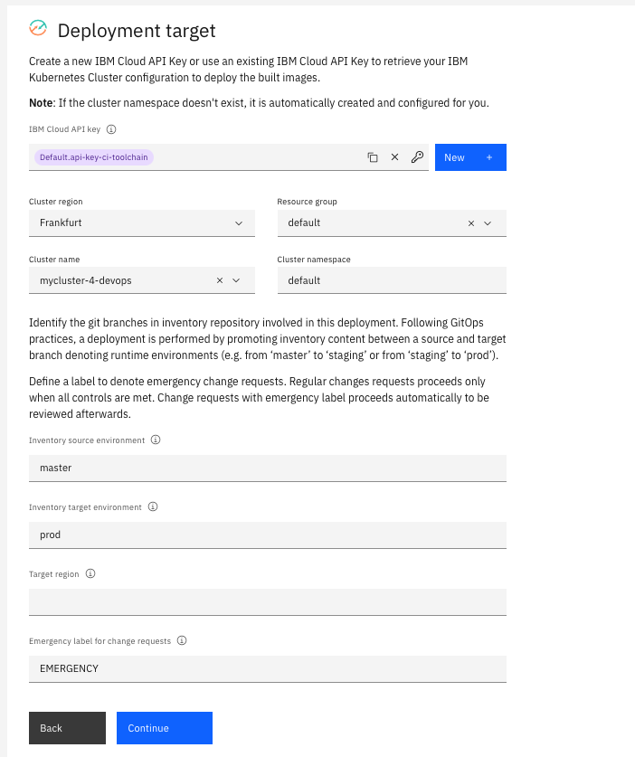{: caption="DevSecOps Tekton Pipeline" caption-side="bottom"}

### Inventory target and source branches
{: #devsecops-cd-tool-integration-inventory-branches}

* **Inventory Source Environment**: The environment from where you want to promote the application Default: master
* **Inventory Target Environment**: The environment to where you want to deploy the application Default: prod
* **Target Region**: The target region to where the application is deployed (Optional)
* **Emergency Label for change request PRs and issues**: Label on Change Request to be used for Emergency deployment

### Change request management
{: #devsecops-cd-tool-integration-change-request}

IBM Cloud hosted GRIT(Git Repos and Issue Tracking) repository to manage Change Requests.

### Git Repo Issues and Tracking
{: #devsecops-cd-tool-integration-GRIT}

**New repository name**: Name of the GRIT Repository to be used for Change Request Management.

The default behavior of the toolchain is to `Use default GRIT change request management repository` that creates a new Change Request Management Repository as IBM hosted GRIT Repository. Choose a unique name for the new repository.

In case you have an existing Change Request repository from an existing CD Toolchain, use the `Advanced Options` toggle button to configure the same for this pipeline.

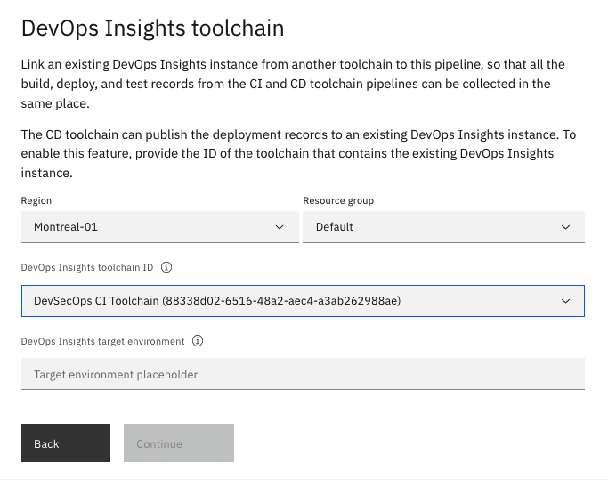{: caption="Change Request Management" caption-side="bottom"}

### Link to existing DevOps Insights Toolchain
{: #devsecops-cd-tool-integration-insights}

We already created an instance of DevOps Insights during the CI toolchain creation. The same needs to be referred to in the CD toolchain. After each compliance check evidence is published into it. The toolchain publishes the deployment records to DevOps insights. You can link DevOps Insights integration from CI toolchain by providing the Integration ID to consolidate all the deployment data in single DevOps Insight Instance.

You can copy the Toolchain ID from the URL of your toolchain. A toolchain's URL follows this pattern: `https://cloud.ibm.com/devops/toolchains/<toolchain-ID-comes-here>?env_id=ibm:yp:us-south`

For example, if the URL is: `https://cloud.ibm.com/devops/toolchains/aaaaaaa-bbbb-cccc-dddd-eeeeeeeeeeee?env_id=ibm:yp:us-south` then the toolchain's ID is: `aaaaaaa-bbbb-cccc-dddd-eeeeeeeeeeee`.

Make sure to include only the ID here, not the full URL.
{: note}

You can also set a target environment for the DOI interactions. This parameter is optional. If you provide this parameter, it is used instead of the target environment from the inventory.

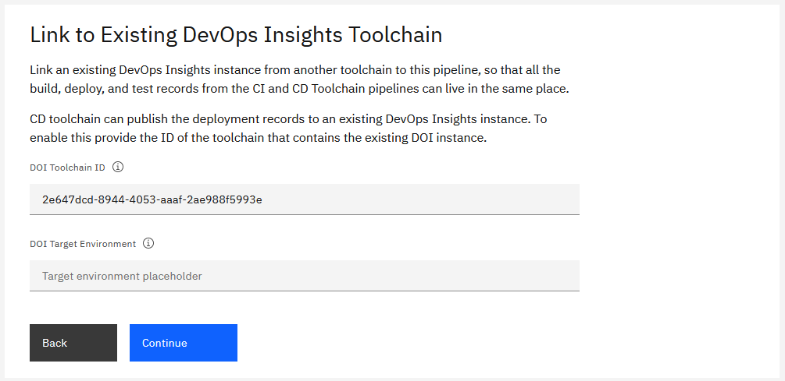{: caption="DevSecOps DevOps Insights Toolchain" caption-side="bottom"}

### Optional Tools
{: #devsecops-cd-tool-integration-optional-tools}

#### Slack
{: #devsecops-cd-tool-integration-slack}

If you want to receive notifications about your PR/CI Pipeline events, you can configure the [Slack Tool](/docs/ContinuousDelivery?topic=ContinuousDelivery-slack) during the setup from the toolchain template, or you can add the Slack Tool later.

In order for a Slack channel to receive notifications from your tools, you need a Slack webhook URL. To get a webhook URL, see the Incoming Webhooks section of the [Slack API website](https://api.slack.com/messaging/webhooks){: external}.

{: caption="DevSecOps Slack" caption-side="bottom"}

After you create your toolchain, you can toggle sending notifications with the slack-notifications Environment Property in your CD Pipeline (0 = off, 1 = on):

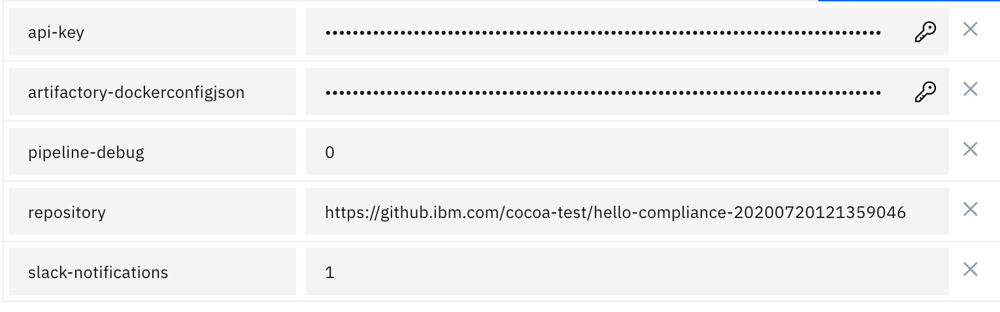{: caption="DevSecOps Slack toggle" caption-side="bottom"}

#### Security and Compliance
{: #devsecops-cd-tool-integration-scc}

To integrate the toolchain with the Security and Compliance Service, you need to provide a project name and the evidence locker repository name for the Security and Compliance data collector.

{: caption="DevSecOps Security and Compliance" caption-side="bottom"}

You can also configure the Security and Compliance integration to trigger a validation after a deployment. For more information about how to choose a profile name, see [Managing security and compliance with Continuous Delivery](/docs/ContinuousDelivery?topic=ContinuousDelivery-cd-manage-security-compliance).

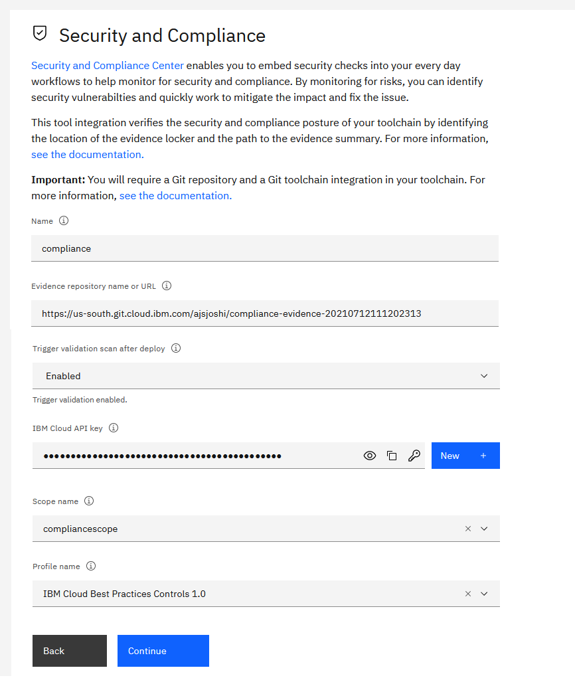{: caption="DevSecOps Security and Compliance Enabled" caption-side="bottom"}

Learn more about the [Security and Compliance Center](https://cloud.ibm.com/security-compliance/overview){: external}.

## Create the CD toolchain
{: #devsecops-cd-toolchain-summary}
{: step}

On the Summary page, click **Create**, and wait for the toolchain to be created.

The individual toolchain integrations can be configured also after the pipeline is created.
{: tip}

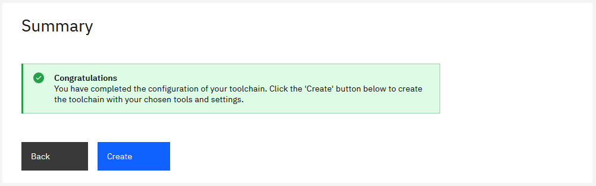{: caption="DevSecOps Summary Page" caption-side="bottom"}

{: caption="DevSecOps CD Toolchain Created" caption-side="bottom"}

## Explore the CD toolchain
{: #devsecops-cd-toolchain-explore}
{: step}

### Run the Promotion Pipeline
{: #devsecops-cd-toolchain-promotion-pipeline-run}

* Make sure that the CI Pipeline ran successfully before you run the Promotion Pipeline.
* The Promotion Pipeline creates a Pull Request with the content of the inventory on the Inventory Source Environment (for example: master) branch targeting the Inventory Target Environment branch (for example: staging or prod). An intermediary branch for the PR is created which can be discarded after the PR is merged.

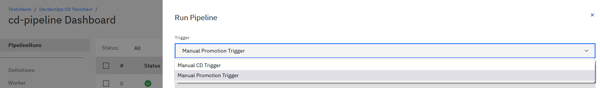{: caption="DevSecOps Promotion Pipeline" caption-side="bottom"}

After the `Promotion Pipeline` finishes successfully, the `promote` Task should provide you a link to the `Pull Request` in the Inventory Repository. The pull request name is of the format `promote <Inventory Source Environment> to <Inventory Target Environment>`.

1. Open the `Pull Request` in your browser with the link provided in the log. Complete the details in the following sections:
   * **Priority**: (mandatory) One of Critical, High, Moderate, Low, Planning
   * **Change Request assignee**: (mandatory) email-id of the assignee
   * **Additional Description**: Description about the changes in the application
   * **Purpose**: Purpose of the changes that are made to the application
   * **Explanation of Impact**: Impact of the change to the application behavior or environment
   * **Backout Plan**: Steps to back out in case of deployment failure
1. Complete the fields in the `Pull Request` and `save`.
1. Add the `EMERGENCY` label to your PR if any compliance checks in CI failed and you want to continue with deployment
1. Merge the `Pull Request` from the GRIT.

The details of the `Pull Request` are used by the CD Pipeline to create a Change Request in Change Request Management repository during the CD pipeline run.

### Run the CD Pipeline
{: #devsecops-cd-toolchain-cd-pipeline-run}

You can start a CD pipeline in either of the following ways:
* Trigger the CD pipeline manually.
* Automatically after every `Merge` action in Inventory Repository. After the merge, you must manually trigger the run of CD Pipeline. A GRIT trigger is set up to trigger automatic CD Pipeline, but is disabled by default and can be enabled after the first promotion.

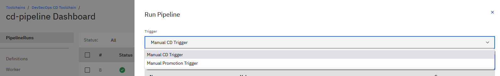{: caption="DevSecOps CD Pipeline Manual Promotion" caption-side="bottom"}

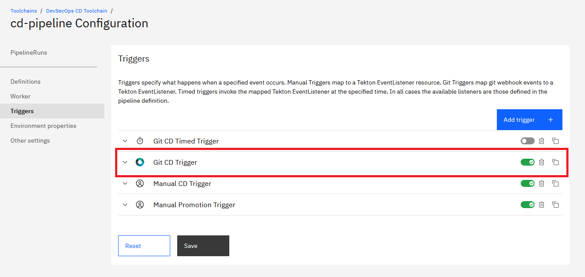{: caption="DevSecOps CD Pipeline Automatic Promotion" caption-side="bottom"}

You can also trigger the `CD Pipeline` manually anytime, but if there are no changes since the last successful deployment, the `CD pipeline` doesn't deploy anything new.
{: tip}

A successful CD pipeline run looks like this:

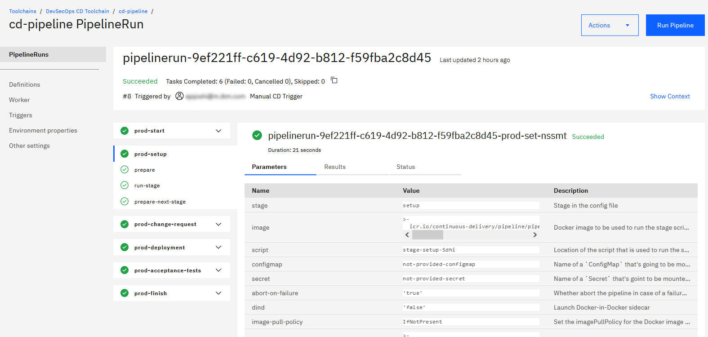{: caption="DevSecOps CD Pipeline Successful" caption-side="bottom"}

Flow of the tasks in the CD Pipeline:

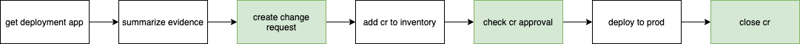{: caption="DevSecOps CD tasks" caption-side="bottom"}

After a successful CD pipeline run, you can find the sample app running on the prod namespace.
The app url can be found under `run stage` substep of  `prod deployment` step of CD Pipeline run.
Use that url to check that the app is running.

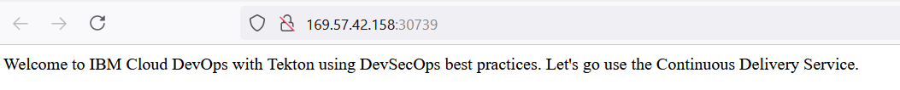{: caption="DevSecOps App running" caption-side="bottom"}

## Related content
{: #devsecops-related-content}

* [Getting started with clusters](/docs/containers?topic=containers-getting-started)
* [Getting started with toolchains](https://cloud.ibm.com/devops/getting-started){: external}
* [Getting started with Continuous Delivery](/docs/ContinuousDelivery?topic=ContinuousDelivery-getting-started)

## Looking for help?
{: #devsecops-tutorial-help}

Get help fast directly from the {{site.data.keyword.cloud_notm}} {{site.data.keyword.contdelivery_short}} development teams by joining us on [Slack](https://ic-devops-slack-invite.us-south.devops.cloud.ibm.com/){: external}.

For more support options, see [Getting help and support for {{site.data.keyword.contdelivery_short}}](/docs/ContinuousDelivery?topic=ContinuousDelivery-gettinghelp).

## Next steps
{: #tutorial-cd-devsecops-next}

Although this tutorial uses an example Node.js app, you can also deploy other language-based apps.
