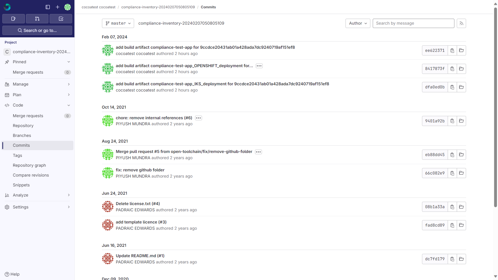
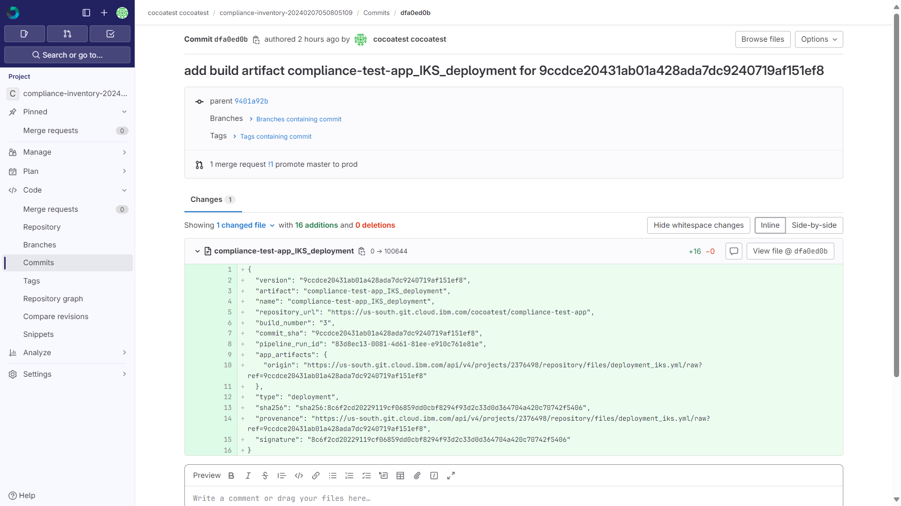

---

copyright:
  years: 2024
lastupdated: "2024-09-27"

keywords: DevSecOps, inventory model, inventory, IBM Cloud

subcollection: devsecops

---

{{site.data.keyword.attribute-definition-list}}

# Gathering evidence of your baseline configuration
{: #evidence-baseline-config}

When you are going through an audit, you must provide evidence that your development and production environments are meeting the criteria in the regulatory standards that you claim compliance with.

## Before you begin
{: #before-evidence-baseline-config}

Before you can start gathering evidence, be sure that you have the following prerequisites:

* Configured DevSecOps CI and CD pipelines that completed successfully.
* The Viewer role or higher on the Continuous Delivery service. For more information, see [Managing access for toolchains in resource groups](/docs/ContinuousDelivery?topic=ContinuousDelivery-toolchains-iam-security).

## Viewing baseline configuration details in Git Repos and Issue Tracking
{: #gather-evidence-baseline-config-gl}

1. In the {{site.data.keyword.cloud_notm}} console, click the **Menu** icon  > **Platform Automation** > **Toolchains**. 
2. Select the CI toolchain for which you want to provide evidence.
3. In the **Repositories** section on the **Overview** tab, click the link that is associated with `compliance-inventory`. The associated repository opens.
4. Take the following screen captures:

   * The repository root
      {: caption="Figure. Example screen capture" caption-side="bottom"}

   * The commit history in the primary branch

      {: caption="Figure. Example screen capture" caption-side="bottom"}

   * The file contents for one or more inventory entries.

      {: caption="Figure. Example screen capture" caption-side="bottom"}

## Reviewing and updating the baseline configuration details
{: #gather-evidence-review-baseline}

When a change is made to your configuration, it is important to be able to show that you take all of the necessary steps to meet the criteria in the regulatory standards that you claim compliance with.

A Change Request that details the changes that were made can help you to prove that you meet the control.

1. Open the Change Request that's associated with the baseline configuration. For information about navigating to a Change Request in Git Repos and Issue Tracking, see [Viewing Change Request details](/docs/devsecops?topic=devsecops-evidence-change-request-GL). 
2. Provide a screen capture of the Change Request that includes the deployment details.
3. Provide information from latest CC pipeline run that includes the contents rescanned.
4. In addition, you can go to any CI/CD/CC pipeline-run and download the logs archive to the environment configuration. All configurations, including the definition and environment variables, can be seen as `*.json` format.

Logs are also stored persistently in a Cloud Object Storage evidence locker according to expiry contracts.
{: note}

## Comparing baseline configuration details in Git Repos and Issue Tracking
{: #gather-evidence-compare-config-GL}

1. Complete the steps to gather evidence for [viewing a baseline configuration](/docs/devsecops?topic=devsecops-evidence-baseline-config-gl).
2. Go to the inventory repository.
3. From the **Select Git revision** drop-down, select your release. For example, in this image, the revision is called `prod_latest`

   {: caption="Example screen capture" caption-side="bottom"}

4. Select the `prod_latest` release option.
5. Click **Compare**.
6. Make a selection to compare the `prod_latest` release against any other release that's listed.
