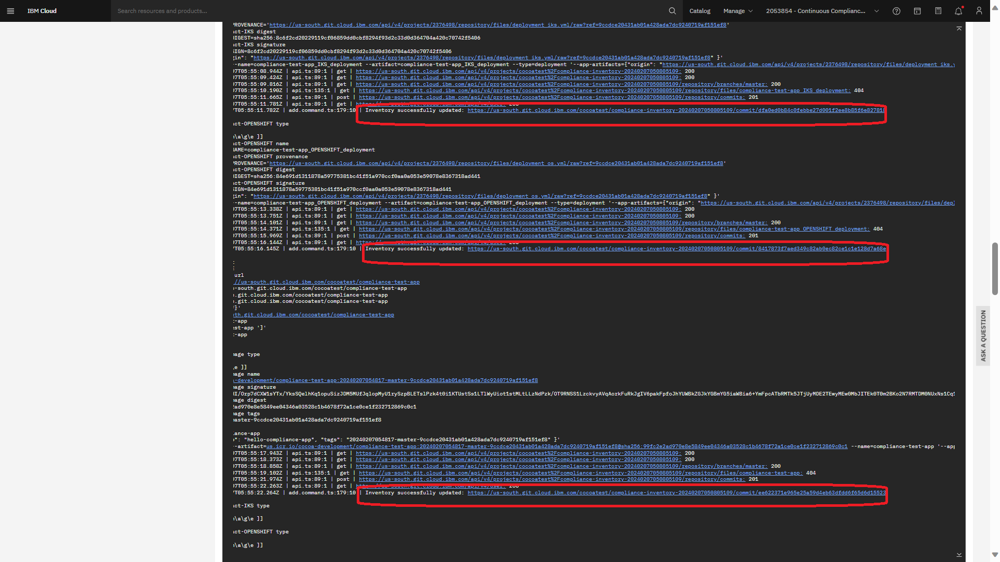

copyright:
  years:  2024, 2024
lastupdated: "2024-08-07"

subcollection: devsecops

---

{{site.data.keyword.attribute-definition-list}}

# Gathering evidence for inventory
{: #evidence-ci-inventory}

When you are going through an audit, you must provide evidence that your development and production environments are meeting the criteria in the regulatory standards that you claim compliance with.

## Before you begin
{: #before-evidence-ci}

Before you can start gathering evidence, be sure that you have the following prerequisites:

* Configured DevSecOps CI and CD pipelines that have successfully completed.
* The Viewer role or higher on the Continuous Delivery service. For more information, see [Managing access for toolchains in resource groups](/docs/ContinuousDelivery?topic=ContinuousDelivery-toolchains-iam-security).

## Viewing inventory commit details
{: #gather-evidence-cr}

If your auditor requests proof of change logs, you can use the following steps to create a screen capture of your configuration.

1. In the {{site.data.keyword.cloud_notm}} console, click the **Menu** icon  **> DevOps > Toolchains**, and select the toolchain for which you want to provide evidence.
2. In the **Delivery pipelines** section on the **Overview** tab, click `cd-pipeline`. A list of triggers is displayed.
3. Click the `Manual CD Trigger` to view the previous pipeline runs.
4. Select a specific `cd-pipelinerun` on the **Pipeline runs** page. The details of the run open.
5. From here, click the `deploy-release` stage then click the **run-stage** step to display the corresponding logs.
6. Search for "Inventory successfully updated" in the logs to view all the inventory commits.

The commit URL doesn't direct you to the inventory repository.
{: note}

## Providing evidence of inventory updates during CI pipeline execution
{: #gather-evidence-inventory-update}

1. In the {{site.data.keyword.cloud_notm}} console, click the **Menu** icon  **> DevOps > Toolchains**, and select the toolchain for which you want to provide evidence.
2. In the **Delivery pipelines** section on the **Overview** tab, click `ci-pipeline`. A list of triggers is displayed.
3. Click a `Git` or `Manual` trigger to view the previous pipeline runs.
4. Select `ci-pipelinerun` on the **Pipeline runs** tab. The details of the run open.
5. Go to the **Deploy release** > **Run stage** tab.
6. Search for "Inventory successfully updated" in the logs and view the inventory commits.

   {: caption="Figure. Example screen capture" caption-side="bottom"}

Alternately, you can go to the inventory repository that captures the state of the baseline configuration, and go to the commit history to check for recent inventory commits.
{: tip}

## Providing evidence of control updates
{: #gather-evidence-inventory-controls}

After every successful CI pipeline run, the inventory repository is updated.

To view evidence that the controls were updated as part of the pipeline run at the inventory level, you can go to the inventory repository and view the updates. For information about navigating to the repository, see [Showing changes between branches in Git Repos and Issue Tracking](/docs/devsecops?topic=devsecops-gather-evidence-pr-change-gl). 
{: tip}

To view evidence that the controls were updated at the pipeline level, you can use the following steps.

1. In the {{site.data.keyword.cloud_notm}} console, click the **Menu** icon  **> DevOps > Toolchains**, and select the toolchain for which you want to provide evidence.
2. In the **Delivery pipelines** section on the **Overview** tab, click `ci-pipeline`.  A list of triggers is displayed.
3. Click a `Git` or `Manual` trigger to view the previous pipeline runs.
4. Select `ci-pipelinerun` on the **Pipeline runs** tab. The details of the run open.
5. Go to the **Deploy release** > **Run stage** tab.
6. Verify the updates by searching for `compliance`. You see entries similar to the following snippet.

   ```text
   1455 | INFO | 2024-02-27T07:12:29.671Z | add.command.ts:179:10 | Inventory successfully updated: https://github.ibm.com/jaunin-b/hello-compliance-inventory/commit/8e7bf9ed6b15af8603109575d9089032779a8de0
   1550 | DEBUG | 2024-02-27T07:12:31.763Z | api.ts:89:1 | get | https://github.ibm.com/api/v3/repos/cd-jumpstart/hello-compliance-inventory: 200
   1550 | DEBUG | 2024-02-27T07:12:32.239Z | api.ts:89:1 | get | https://github.ibm.com/api/v3/repos/cd-jumpstart/hello-compliance-inventory: 200
   1550 | DEBUG | 2024-02-27T07:12:32.659Z | api.ts:89:1 | get | https://github.ibm.com/api/v3/repos/cd-jumpstart/hello-compliance-inventory/git/ref/heads/master: 200
   1550 | DEBUG | 2024-02-27T07:12:33.108Z | api.ts:89:1 | get | https://github.ibm.com/api/v3/repos/cd-jumpstart/hello-compliance-inventory/contents/hello-compliance-app: 200
   1550 | DEBUG | 2024-02-27T07:12:37.087Z | api.ts:89:1 | put | https://github.ibm.com/api/v3/repos/cd-jumpstart/hello-compliance-inventory/contents/hello-compliance-app: 200
   ```
   {: screen}
