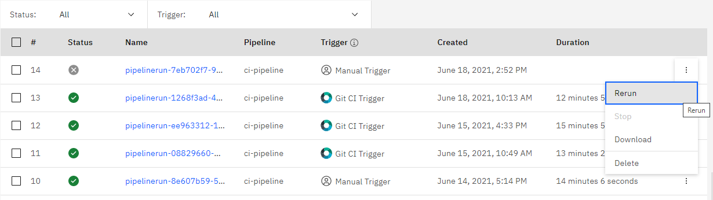
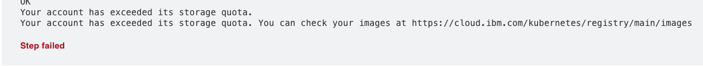
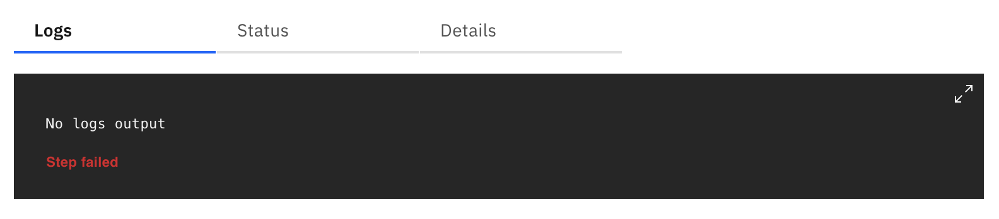
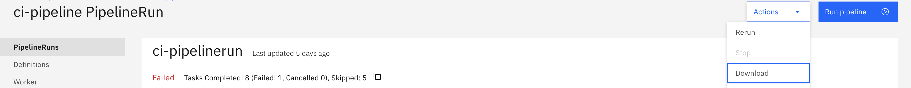
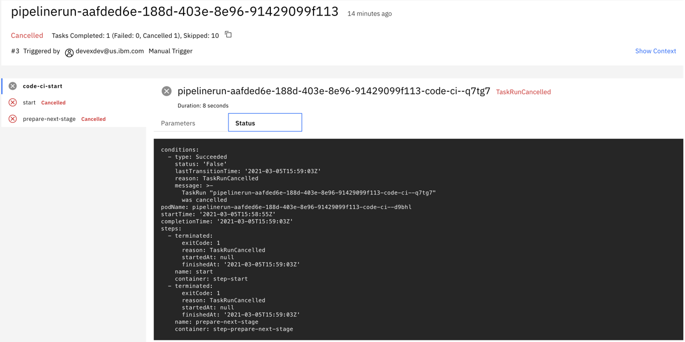
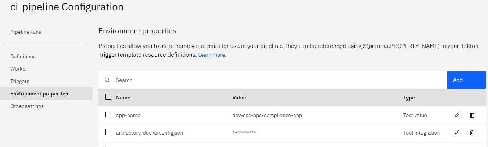
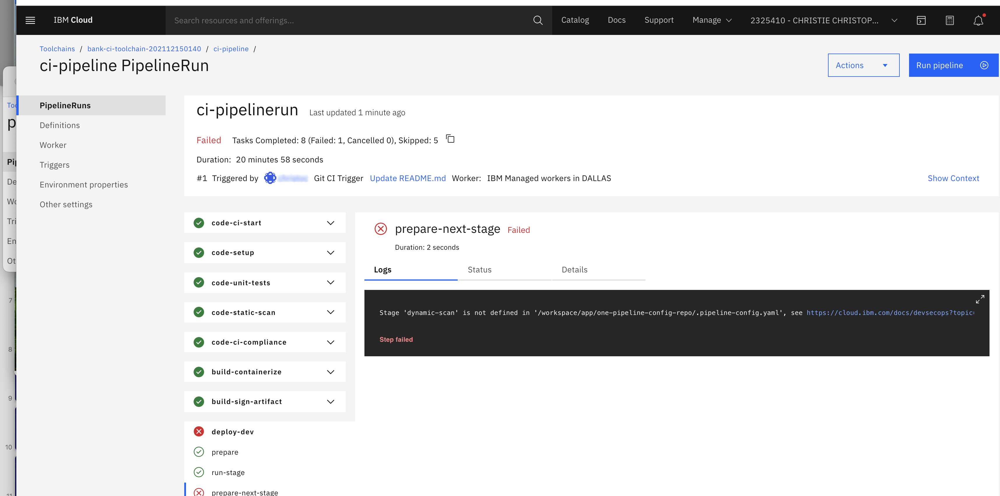

---

copyright: 
  years: 2021, 2023
lastupdated: "2023-07-18"

keywords: troubleshoot, DevSecOps

subcollection: devsecops

---

{{site.data.keyword.attribute-definition-list}}

# Troubleshooting for DevSecOps
{: #troubleshoot-devsecops}

Use these tips to help troubleshoot problems that you might run into when you use DevSecOps.
{: shortdesc}

## General troubleshooting methods
{: #troubleshoot-general}
{: troubleshoot}
{: support}

* Reload the page in case the UI is slow or the logs fail to load.
* Check for outages on the [status page](https://cloud.ibm.com/status){: external}
* Run the pipeline again.

   {: caption="Figure 1. Manual Promotion Trigger" caption-side="bottom"}

## IBM environment issues
{: #troubleshoot-ibm-env}
{: troubleshoot}
{: support}

### The check-registry step of the containerize task fails with error
{: #troubleshoot-check-registry}
{: troubleshoot}
{: support}

{: caption="Figure 2. Storage quota error" caption-side="bottom"}

{{site.data.keyword.cloud_notm}} registry offers a limited quota, pushing too many images it can be exceeded.

Go to images, delete some of them, and rerun the pipeline.

You can check your quota limits and usage by using the following command:

```bash
ibmcloud cr quota
```

### Logs do not show for step
{: #troubleshoot-missing-logs}
{: troubleshoot}
{: support}

{: caption="Figure 3. Logs do not show" caption-side="bottom"}

This is an issue with the Tekton environment.

Try reloading the page.
Download the logs by using the download button.

{: caption="Figure 4. Download logs" caption-side="bottom"}

## Template and pipeline issues
{: #troubleshoot-template-pipeline}
{: troubleshoot}
{: support}

### Task is cancelled because base image cannot be accessed
{: #troubleshoot-base-image-inaccessible}
{: troubleshoot}
{: support}

{: caption="Figure 5. Base image is not accessed" caption-side="bottom"}

Check whether your artifactory credentials are correct. A new artifactory token can be created here.
You can create a secret manually by running:

```bash
kubectl create secret docker-registry mysecret \
--dry-run \
--docker-server=wcp-compliance-automation-team-docker-local.artifactory.swg-devops.com  \
--docker-username=<username> \
--docker-password=<artifactory token> \
--docker-email=<email> \
-o yaml
```

It outputs something similar to the following:

```text
apiVersion: v1
data:
  .dockerconfigjson: <your secret>
kind: Secret
metadata:
  creationTimestamp: null
  name: regcred
type: kubernetes.io/dockerconfigjson
```

In the pipeline properties, update the `artifactory-dockerconfigjson` parameter with the ``.dockerconfigjson`` value.

{: caption="Figure 6. Update artifactory-dockerconfigjson" caption-side="bottom"}

For more information, check out the [kubectl documentation on creating a secret](https://kubernetes.io/docs/concepts/configuration/secret/)(: external).

### Pipeline aborts early
{: #troubleshoot-pipe-abort-early}
{: troubleshoot}
{: support}

My pipeline early aborts with the following message: 

`Pipeline could not run, resource failed to apply - Kind: "Secret", Name: "pipeline-pull-secret" ResourceError`

The pipeline did not even start, and no logs are available.

The `dockerconfig.json` secret, which pulls the Docker images from IBM Container Registry that is used by this pipeline is not correct.
{: tsSymptoms}

This secret might be incorrect, or the API key that is associated to this secret is rotated or revoked.
{: tsCauses}

Generate a new `dockerconfig.json` then use this new secret value in your pipeline (either as a pipeline parameter, or stored in Secrets Manager).
{: tsResolve}

To generate a new `dockerconfig.json`, run the following command:

```bash
kubectl create secret docker-registry my-registry-secret \
 -o json \
 --dry-run=client \
 --docker-server=icr.io \
 --docker-username=iamapikey \
 --docker-email=john-doe@ibm.com \
 --docker-password=<apikey> \
  | jq -r '.data[".dockerconfigjson"]'
```
  
Where ``<apikey>`` is your {{site.data.keyword.cloud_notm}} Cloud API key or a Service ID API key.

### Pipeline cannot pull images from different artifactory repositories
{: #pipeline-cannot-pull-images}
{: troubleshoot}
{: support}

The pipeline was successful in pulling images from one repository but not from the other repository.
{: tsSymptoms}

The pipeline fails because it is configured to pull from a single repository.
{: tsCauses}

It is required that users manually create artifactory dockerconfigjson to support multiple authentications when they are trying to pull multiple images from different repositories.
{: tsResolve}

To support multiple authentications for pulling images from different repositories in Artifactory, manually add the `artifactory-dockerconfigjson` environment variable to the pipeline as a secret. The value of this environment property must be set to the content that is generated by the following steps.

The script provides a sample of creating an artifactory-dockerconfigjson that can provide authentication details to authenticate against two artifactory repositories. You can customize it to meet your requirements.

#### Prerequisites
{: #pipeline-cannot-pull-images-prereqs}

The `kubectl` and `jq`  commands must be installed.

#### Steps
{: #pipeline-cannot-pull-images-steps}

1. Open a text editor that supports saving in "LF" (Line Feed) character mode line endings.
2. Create a file and copy the contents of the following script:

   ```bash
   dockerconfig_1=$(kubectl create secret docker-registry my-registry-secret \
   --output json \
   --dry-run=client \
   --docker-server="<artifactory_repo_host>" \
   --docker-username="<email>" \
   --docker-email="<email>" \
   --docker-password="<artifactory_token>" \
   | jq -r '.data[".dockerconfigjson"]')

   dockerconfig_2=$(kubectl create secret docker-registry my-registry-secret \
   --output json \
   --dry-run=client \
   --docker-server="<second_repo_host>" \
   --docker-username="<email>" \
   --docker-email="<email>" \
   --docker-password="<second_artifactory_token>" \
   | jq -r '.data[".dockerconfigjson"]')

   echo $dockerconfig_1 | base64 -d > first_secret.json
   echo $dockerconfig_2 | base64 -d > second_secret.json
   new_dockerconfig=$(jq -s '.[0] * .[1]' first_secret.json second_secret.json | base64 -w0)
   echo ${new_dockerconfig} > final_dockerconfig.txt
   ```

3. Replace the placeholder values with the actual authentication details:
   - Replace `<artifactory_repo_host>` with the link to the first repository.
   - Replace `<artifactory_token>` with the authentication token for the first repository.
   - Replace `<email>` with the email associated with the authentication.
   - Replace `<second_repo_host>` with the link to the second repository.
   - Replace `<second_artifactory_token>` with the authentication token for the second repository.
4. Save the file.
5. Ensure that the file is saved in a directory with write permissions.
6. Run the script.
7. Add the contents of `final_dockerconfig.txt` as a secret in the pipeline environment variables for `artifactory-dockerconfigjson`. If you are using Secrets Manager or Key Protect, save the contents of this file by using appropriate techniques.

## Image signing issues
{: #troubleshoot-signing}
{: troubleshoot}
{: support}

If your image signing task fails, see the [image signing documentation](/docs/devsecops?topic=devsecops-devsecops-image-signing) to verify that the signing key was correctly generated and stored.

## Issues related to Dynamic Scan Stage not defined in pipeline configuration
{: #troubleshoot-dynamic-scan-stage}
{: troubleshoot}
{: support}

The CI Pipeline run fails with an error.

{: caption="Figure 7. CI Pipeline Run failing for Dynamic-Scan stage" caption-side="bottom"}

The error occurs when the CI pipeline configuration does not contain task definition to run the dynamic-scan. Add the following snippet in `.pipeline-config.yaml` and customize the step to suit your application.

```bash      
   dynamic-scan:
      dind: true
      abort_on_failure: false
      image: icr.io/continuous-delivery/pipeline/pipeline-base-image:2.12@sha256:ff4053b0bca784d6d105fee1d008cfb20db206011453071e86b69ca3fde706a4
      script: |
      #!/usr/bin/env bash
      echo "Please insert script to invoke/execute dynamic scan tool like OWASP ZAP on the built and deployed application."
```
{: codeblock}

For more information about the stages, see [Custom scripts](/docs/devsecops?topic=devsecops-custom-scripts).

## Troubleshooting {{site.data.keyword.contdelivery_short}}
{: #troubleshoot-cd-related}

For more general issues related to the {{site.data.keyword.contdelivery_short}} service, see the {{site.data.keyword.deliverypipeline}} [troubleshooting page](/docs/ContinuousDelivery?topic=ContinuousDelivery-troubleshoot-delivery-pipeline).

## Getting help from the community
{: #troubleshoot-devsecops-community}

Not finding your answer, solution? Get help fast directly from the {{site.data.keyword.cloud_notm}} development teams and other users.

The DevSecOps team actively monitors our Slack channel for questions about the DevSecOps, {{site.data.keyword.contdelivery_short}} services, and toolchains.

[](https://ic-devops-slack-invite.us-south.devops.cloud.ibm.com/){: external}
